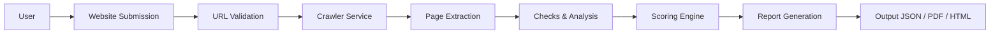
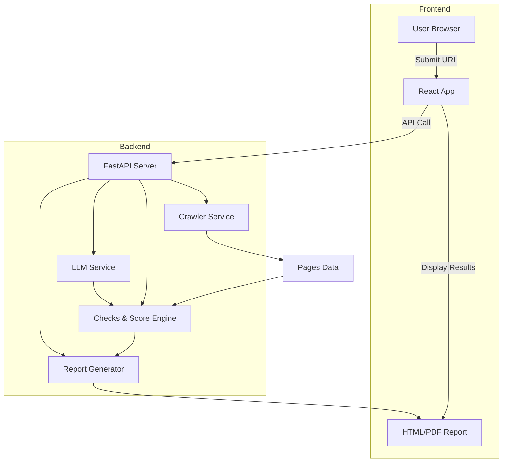

# Feature Specification: GEO Auditor

**Executive Summary:** This document defines the AI Citation Readiness Auditor (“GEO Auditor”), a tool to help businesses be discoverable and citable by AI assistants (ChatGPT, Perplexity, Gemini, etc.) instead of traditional search engines.  The GEO Auditor takes a public website URL, crawls key pages, evaluates signals critical to AI retrieval (structured data, accessibility, content structure, entity consistency, freshness), computes a transparent score, and generates a concise business report with evidence and prioritized fixes. Unlike SEO tools that focus on ranking, this auditor measures **AI visibility** (also called Generative Engine Optimization, GEO or Answer Engine Optimization, AEO). For example, it checks if an FAQ section is visible and schema-tagged (so LLMs can extract Q&A content), if `robots.txt` or a proposed `llms.txt` file guides AI crawlers, and if company facts (name, address, phone) are consistent across pages. Scores are broken down by category so site owners see exactly where points are lost. All assumptions (e.g. English-only, max 20 pages, depth 2, 30s crawl) and interfaces are documented to prevent hallucination. This spec enables an agent to implement the MVP efficiently and unambiguously.

## Product Philosophy

- **AI Search vs. Traditional SEO:**  AI assistants (ChatGPT, Gemini, Google AI Overviews, Perplexity, etc.) retrieve answers differently from Google’s blue links. They often cite pages by snippet or “overview” rather than rank. Thus, we audit for *citation readiness* rather than keyword ranking. We focus on features that help LLMs find, parse, and trust a site’s information, not just traditional SEO factors.  
- **GEO/AEO Objective:**  Our goal is to answer: *“When an AI user asks about [industry/category], does this business show up, and are its facts correct?”*. GEO (Generative Engine Optimization) and AEO (Answer Engine Optimization) refer to this goal of being recommended by AI answer engines, especially for local businesses. Traditional SEO audit tools can’t answer this (they won’t say if ChatGPT even knows a brand exists), so we build one specifically for AI visibility.  
- **Evidence-First & Score Transparency:** Every finding includes concrete evidence (page URL, HTML snippet or JSON-LD excerpt), a clear recommendation, and an estimated impact. The score is fully decomposed by category and check, so users see *why* they lost points. This matches research guidance: “Schema is core infrastructure for AI understanding” and still “critical” for Google’s Knowledge Graph.  
- **Content-Centric over Schema:** Research shows LLMs **tokenize** all page text (including JSON-LD) but don’t semantically parse it. In practice, *visible* content structure (like Q&A format) often outweighs hidden markup in direct citations. We incorporate both: 
  - **Structured Data Layer:** We ensure schemas (Organization, FAQPage, Article, etc.) exist to strengthen Google’s Knowledge Graph which indirectly boosts AI visibility.  
  - **Visible Content Layer:** We also audit on-page Q&A sections, headings, lists, and factual consistency, since LLMs rely on these for answers.  
- **SMB/Sales-Focused:** Like top GEO tools, we target SMB/agency use-cases – fast, one-off audits with clear fixes. We won’t build user accounts, dashboards, or long-term tracking (out of scope) – just the core audit and report MVP.

## Core Workflow



1. **Website Submission:** User provides a public website URL (e.g. `https://example.com`).
2. **URL Validation:** System normalizes and validates the URL, ensuring it’s public and well-formed (rejecting localhost, IP, private domains, etc.).
3. **Crawler Service:** The backend crawls the site (depth ≤ 2, ≤ 20 pages, respecting robots.txt).
4. **Page Extraction:** For each fetched page, extract HTML, metadata (titles, headings, JSON-LD), and text.
5. **Checks & Analysis:** Run a suite of **AI Visibility Checks** (see Feature Specs below) on the extracted pages. Each check returns pass/fail, a score, evidence, and recommendation.
6. **Scoring Engine:** Aggregate check results into category scores and an overall score out of 100, with detailed breakdown.
7. **Report Generation:** Assemble an executive summary and structured report (JSON/HTML/PDF) including overall score, category scores, list of issues (with evidence, severity, impact, effort), and prioritized fixes.
8. **Output:** Return the report to the frontend for user review or download.

## System Architecture



- **Frontend (React):** Captures URL input and displays the final report.
- **Backend (FastAPI):** Exposes a POST `/audit` endpoint (see API Spec) and orchestrates services.
- **Crawler Service:** Downloads pages, extracts metadata. Returns a structured `Page[]` (each with URL, HTML, text, meta, JSON-LD, etc.).
- **Checks & Analysis:** Modules implement each check (see Check Library). They take the `Page[]` data and produce structured results (score, evidence, recommendation). **Checks do not call LLMs.**
- **Score Engine:** Combines check outputs into category and total scores using defined weights and rules.
- **LLM Service (optional):** Invokes an LLM (e.g. OpenAI or Gemini) for generating explanations or fixes from structured prompts. **LLM does not alter scores** (used only for human-readable text).
- **Report Generator:** Formats the findings into JSON or PDF/HTML. Uses the scored data and LLM outputs to produce the final report.

## Feature Specifications

Below are the **MVP feature specs**. Each is defined with its purpose, input/output contract, detection logic, scoring, and recommendation.

### 1. Website Submission

- **Purpose:** Accept and normalize the target site URL.
- **Input:** Raw URL string from user (e.g. `"example.com"`, `"http://example.com/page"`).
- **Validation Rules:**  
  • Must include a valid public domain (e.g. `example.com`). Reject IPs, `localhost`, private domains (e.g. `example.local`).  
  • Accepts HTTP/HTTPS. Defaults to HTTPS if scheme missing.  
  • Follow HTTP redirects to final homepage.  
- **Output:** 
  ```json
  { "domain": "example.com", "homepage": "https://example.com/" }
  ```
- **Acceptance:**  
  - Returns 400 error for invalid URLs or private ranges.  
  - Resolves final canonical homepage (follow 301/302).  
  - Strips URL fragment/query for domain.  
- **Evidence:** N/A (this step just normalizes).  
- **Recommendation:** None (pre-check).  

### 2. Website Crawl

- **Purpose:** Gather relevant pages from the site for analysis.
- **Input:** Domain/Homepage URL (string).
- **Output:**  
  ```json
  {
    "pages": [
      {
        "url": "https://example.com/",
        "html": "<!DOCTYPE html>…</html>",
        "text": "Visible page text…",
        "headers": ["Welcome to Example"],
        "links": ["https://example.com/about", "..."],
        "json_ld": { ... },
        "canonical": "https://example.com/",
        "last_mod": "2026-07-15",
        "status": 200
      },
      … up to 20 pages …
    ]
  }
  ```
- **Pages to Crawl:**  
  - Crawl homepage plus up to 19 other pages (limit 20 total).  
  - Suggested paths: `about`, `contact`, `products`, `services`, `blog`, `pricing`, `faq`, `/`.  
  - Follow internal links, obey **robots.txt** (see Check #1).  
  - Depth limit 2 (from homepage).  
- **Output Data:** For each page, collect: title, headings (h1–h3), meta tags (desc, canonical, OG/Twitter), plaintext, all `<script type="application/ld+json">` (parsed as JSON), last-modified header or `<meta>`, HTTP status.
- **Acceptance:**  
  - Completion within **30 seconds** or timeout.  
  - Handles up to 20 pages; stops early if time/limit.  
  - Continue on non-2xx statuses (record status code).  
  - Remove duplicate content (same URL).  
- **Failure Modes:**  
  - If crawl fails, return partial pages with warnings.  
  - Record issues like 500/timeout, but continue others.  

### 3. AI Visibility Checks

Perform the following **12 core checks** on the crawled pages. Each check returns a structured result with: `{ name, passed (bool), score, max_score, evidence, recommendation }`.

A summary table of all checks is shown below; see each spec for details:

| **Check**                  | **Category**         | **Why it Matters**                                                           | **Max Score** |
|----------------------------|----------------------|------------------------------------------------------------------------------|--------------:|
| 1. `robots.txt`            | AI Accessibility     | Tells crawlers (LLMs, bots) which pages to access.           | 10            |
| 2. `sitemap.xml`           | AI Accessibility     | Lists site URLs for crawlers.                                   | 10            |
| 3. `llms.txt`              | AI Accessibility     | Emerging AI-specific guide (like robots.txt).      | 10            |
| 4. Title Tag              | Content Quality      | Appears in search results and AI snippets; critical metadata.                 | 5             |
| 5. Meta Description       | Content Quality      | Summarizes page content for engines; aids AI summarization.                 | 5             |
| 6. Organization Schema    | Structured Data      | Signals business identity to Knowledge Graph.                    | 10            |
| 7. FAQ Schema             | Structured Data      | Q&A markup indirectly helps AI overviews and highlights FAQs.    | 10            |
| 8. Article Schema         | Structured Data      | Marks blog/news content, aiding indexing and Google’s Knowledge Graph.      | 10            |
| 9. Breadcrumb Schema      | Structured Data      | Improves site hierarchy understanding for crawlers.                         | 5             |
| 10. Heading Structure     | Content Structure    | Proper H1/H2 structure signals topic/sections to AI retrieval.              | 5             |
| 11. Business Info (NAP)   | Entity Trust         | Consistent Name-Address-Phone builds trust in AI answers.                   | 10            |
| 12. Content Freshness     | Content Quality      | AI assistants prefer newer/updated content.                    | 5             |

**Total:** 85 points (scores normalized to category weights later).

Below each check is detailed:

#### Check 1: `robots.txt` Access
- **Purpose:** Verify crawling policy. A `robots.txt` file guides crawlers on allowed paths.
- **Detection:** Attempt HTTP GET `https://<domain>/robots.txt`.  
- **Inputs:** Domain or homepage URL.  
- **Outputs:**  
  ```json
  {
    "name": "robots.txt",
    "passed": true/false,
    "score": x,
    "max_score": 10,
    "evidence": "Found Disallow: /private in robots.txt",
    "recommendation": "Remove 'Disallow: /' entry to allow full crawling."
  }
  ```
- **Scoring:**  
  - If **no robots.txt** (404): neutral (passed=true, score=5/10; assume default allow).  
  - If exists:  
    - No `Disallow`: score 10/10.  
    - Some pages disallowed: deduct points proportional to severity (e.g. homepage disallowed = fail).  
    - `Disallow: /` (blocks all): score 0.  
- **Evidence:** Show snippet of robots.txt (line numbers, e.g. `Disallow: /blog/`).
- **Recommendation:** If overly restrictive, instruct to update robots.txt. (E.g. “Remove ‘Disallow: /’ which blocks AI crawlers.”)
- **Why it matters:**  Robots.txt manages crawler access. If AI bots see their own user-agent or “*” disallowed, they may skip site entirely.

#### Check 2: `sitemap.xml` Presence
- **Purpose:** A `sitemap.xml` lists all site URLs for crawlers.
- **Detection:** Try GET `https://<domain>/sitemap.xml` (also check common variants like `/sitemap_index.xml`).  
- **Inputs:** Domain.  
- **Outputs:**  
  ```json
  {
    "name": "sitemap.xml",
    "passed": true/false,
    "score": x,
    "max_score": 10,
    "evidence": "<loc>https://example.com/</loc> ... (snippet)",
    "recommendation": "Create a sitemap.xml listing all pages."
  }
  ```
- **Scoring:**  
  - Found valid XML sitemap with URLs → score 10/10.  
  - Missing (404) → score 0/10 (recommend to add).  
  - Found but empty or with few pages → partial credit (e.g. 5).  
- **Evidence:** Show first `<loc>` entries from sitemap or note “sitemap missing”.  
- **Recommendation:** Provide an example Sitemap XML or a service link (e.g. “Add `<urlset>` tags and include `<loc>` for key pages.”).

#### Check 3: `llms.txt` Presence
- **Purpose:** *Emerging* standard for AI crawlers (like robots.txt for LLMs). It may include site description and links to AI-friendly content.
- **Detection:** GET `https://<domain>/llms.txt`.  
- **Inputs:** Domain.  
- **Outputs:**  
  ```json
  {
    "name": "llms.txt",
    "passed": true/false,
    "score": x,
    "max_score": 10,
    "evidence": "File found with H1 and links.",
    "recommendation": "Add an llms.txt file with a summary and links to key pages."
  }
  ```
- **Scoring:**  
  - Present and non-empty → score 10/10.  
  - Missing → score 0/10. (Since it’s new, we treat missing as lost opportunity.)  
- **Evidence:** Extract first lines (e.g. `# Site Title` and a link list).  
- **Recommendation:** Template like:  
  ```
  # Example Site
  > Brief description of site and its purpose.
  
  ## Key Links
  - [Home](https://example.com)
  - [Products](https://example.com/products)
  - [About Us](https://example.com/about)
  ```
  (This format uses markdown sections as per spec.)  
- **Why it matters:** Though optional, llms.txt signals AI models how to interpret your site. Adding it can improve AI summary accuracy.

#### Check 4: Title Tag
- **Purpose:** HTML `<title>` is a core content signal. AI and search snippets often use it. A missing or poor title hurts both SEO and AI context.  
- **Detection:** For each page, extract `<title>`.  
- **Inputs:** Page HTML.  
- **Outputs (per page):**  
  ```json
  { 
    "name": "Title Tag",
    "page": "/",
    "passed": true/false,
    "score": x,
    "max_score": 5,
    "evidence": "<title>Home - Example Inc</title>",
    "recommendation": "Add a concise title (≤ 60 chars) containing main keyword."
  }
  ```
- **Scoring (per page):**  
  - Present & 20–60 chars → full score (5).  
  - Missing or empty → 0 (fail).  
  - Too long (>60 chars) or duplicated on many pages → partial (2).  
- **Evidence:** Show the existing `<title>` text (or “none”).  
- **Recommendation:** E.g. “Set `<title>Example Company – Leading Widgets</title>` to improve clarity.”  
- **Edge Cases:** If multiple titles found, pick first. If page is an image/video page, still require some title.

#### Check 5: Meta Description
- **Purpose:** `<meta name="description">` summarizes page content. AI models may use it to verify context.  
- **Detection:** Extract `<meta name="description" content="…">`.  
- **Inputs:** Page HTML.  
- **Outputs:**  
  ```json
  { 
    "name": "Meta Description",
    "page": "/about",
    "passed": true/false,
    "score": x,
    "max_score": 5,
    "evidence": "No meta description found.",
    "recommendation": "Add `<meta name=\"description\" content=\"About Example Inc, our values and team...\">`."
  }
  ```
- **Scoring:**  
  - 50–160 chars, relevant → 5/5.  
  - Missing or very short/long → 0/5.  
  - Present but not matching content or duplicate → 2/5.  
- **Evidence:** Current content of the description tag or note “missing”.  
- **Recommendation:** Provide an example description.  
- **Note:** Also check `<link rel="canonical">` if needed (low-priority, not scored, but mention in evidence if missing to avoid duplicate content issues).

#### Check 6: Organization Schema
- **Purpose:** JSON-LD `Organization` or `LocalBusiness` schema signals the business’s official identity (name, logo, address) to knowledge graphs. This builds trust and context.  
- **Detection:** Parse all JSON-LD blocks. Look for an object with `"@type": "Organization"` or `"LocalBusiness"`.  
- **Inputs:** Pages’ JSON-LD and HTML.  
- **Outputs:**  
  ```json
  {
    "name": "Organization Schema",
    "page": "/",
    "passed": true/false,
    "score": x,
    "max_score": 10,
    "evidence": "\"@type\": \"Organization\", \"name\": \"Example Inc\", ...",
    "recommendation": "Include JSON-LD with `{\"@context\":\"https://schema.org\",\"@type\":\"Organization\",\"name\":\"Example Inc\",\"url\":\"https://example.com\",\"logo\":\"https://example.com/logo.png\",\"contactPoint\":{\"@type\":\"ContactPoint\",\"telephone\":\"+1-555-1234\",\"contactType\":\"customer service\"}}`."
  }
  ```
- **Scoring:**  
  - If a valid Org schema is found with name/url → 10.  
  - Missing → 0.  
- **Evidence:** Excerpt of the JSON-LD block (formatted).  
- **Recommendation:** Provide a JSON-LD template, filling detected business name, URL, and contact.  
- **References:** Schema.org defines `Organization` type. Use full URLs.  
- **Edge Cases:** If multiple businesses or conflicting names are found, flag for cleanup. If site is a personal blog, use `Person` schema instead (but for simplicity, score as 0 if no Organization schema).

#### Check 7: FAQ Schema
- **Purpose:** JSON-LD `FAQPage` or `Question`/`Answer` markup explicitly tags Q&A. While LLMs don’t parse it directly, it feeds Google’s Knowledge Graph and highlights content. Visible FAQs help LLMs retrieve answers.  
- **Detection:** In JSON-LD, look for `"@type": "FAQPage"` or a `Question`/`Answer` pair. Alternatively, detect an FAQ HTML section (e.g. headings like “FAQ”).  
- **Inputs:** All pages.  
- **Outputs:**  
  ```json
  {
    "name": "FAQ Schema",
    "page": "/faq",
    "passed": true/false,
    "score": x,
    "max_score": 10,
    "evidence": "\"@type\": \"FAQPage\", ... \"acceptedAnswer\"",
    "recommendation": "Add JSON-LD FAQPage with questions and answers from your FAQ section."
  }
  ```
- **Scoring:**  
  - If site has an FAQ section but **no schema**: 0/10 (strong suggestion to add).  
  - If FAQ content exists *and* valid schema present: 10/10.  
  - If no FAQ section at all (e.g. a simple product page): pass (score=10, no deduction).  
- **Evidence:** Show JSON-LD FAQ snippet or note absence. Also possibly snippet of visible Q&A.  
- **Recommendation:** Example JSON-LD:  
  ```json
  {
    "@context": "https://schema.org",
    "@type": "FAQPage",
    "mainEntity": [
      {
        "@type": "Question",
        "name": "How do I reset my password?",
        "acceptedAnswer": {
          "@type": "Answer",
          "text": "Click the 'Forgot password' link and follow instructions."
        }
      },
      ...
    ]
  }
  ```  
- **Edge Cases:** If answers are on multiple pages, suggest consolidating FAQs. If Google disallows FAQ rich results (general policy), we still want the schema for AI overviews and knowledge.

#### Check 8: Article Schema
- **Purpose:** For blog/news pages, the `Article` (or subtypes like NewsArticle) schema helps content be understood by crawlers and Google’s Knowledge Graph.  
- **Detection:** On pages with dates (e.g. a blog post), check for `"@type": "Article"` (or NewsArticle) in JSON-LD.  
- **Inputs:** Each page.  
- **Outputs:**  
  ```json
  {
    "name": "Article Schema",
    "page": "/blog/post-1",
    "passed": true/false,
    "score": x,
    "max_score": 10,
    "evidence": "\"@type\": \"Article\", \"headline\": \"...\"",
    "recommendation": "Add JSON-LD Article with headline, datePublished, author, and description."
  }
  ```
- **Scoring:**  
  - If page appears to be an article (has date/title) and lacks schema: 0.  
  - If schema present and valid: 10.  
  - Non-article pages: score 10 (not applicable).  
- **Evidence:** Show snippet of Article JSON-LD or note missing.  
- **Recommendation:** Template JSON-LD with keys like `headline`, `description`, `datePublished`, `author`.  
- **References:** See schema.org `Article` (similar usage for news/blogs).  
- **Edge:** If multi-page articles, ensure metadata only on main page.

#### Check 9: Breadcrumb Schema
- **Purpose:** `BreadcrumbList` schema (or link rel="breadcrumb") shows site hierarchy to crawlers. It aids navigation and is sometimes used in search snippets.  
- **Detection:** Look for JSON-LD of type `BreadcrumbList`, or HTML markup with `itemtype="BreadcrumbList"`.  
- **Inputs:** All pages.  
- **Outputs:**  
  ```json
  {
    "name": "Breadcrumb Schema",
    "page": "/products/widget-x",
    "passed": true/false,
    "score": x,
    "max_score": 5,
    "evidence": "\"@type\": \"BreadcrumbList\" ... [\"Home\", \"Products\", \"Widget X\"]",
    "recommendation": "Insert breadcrumb schema or `<nav>` with structured links."
  }
  ```
- **Scoring:** 5 if present on any page, 0 if none found at all.  
- **Evidence:** Snippet of the breadcrumb JSON-LD or HTML.  
- **Recommendation:** A JSON-LD example:  
  ```json
  {
    "@context": "https://schema.org",
    "@type": "BreadcrumbList",
    "itemListElement": [
      { "@type": "ListItem", "position": 1, "name": "Home", "item": "https://example.com" },
      { "@type": "ListItem", "position": 2, "name": "Products", "item": "https://example.com/products" }
    ]
  }
  ```  
- **Why it matters:** Breadcrumbs help Google understand site structure. While less directly linked to AI, they ensure page context is clear.

#### Check 10: Heading Structure
- **Purpose:** Proper use of `<h1>`, `<h2>`, etc., signals the main topics on a page. LLMs favor well-structured content (FAQ lists, headings) for extraction.  
- **Detection:** For each page, ensure: exactly one `<h1>`, and logical sequence of H2/H3.  
- **Inputs:** Page HTML.  
- **Outputs:**  
  ```json
  {
    "name": "Heading Structure",
    "page": "/about",
    "passed": true/false,
    "score": x,
    "max_score": 5,
    "evidence": "<h1>About Example</h1> (1 h1 found)",
    "recommendation": "Use exactly one `<h1>` and organize sections with `<h2>`."
  }
  ```
- **Scoring:**  
  - If each page has exactly one H1: full 5.  
  - If missing H1 or multiple H1s: 0.  
  - H2s should follow logically after H1s (warning if e.g. skip H2).  
- **Evidence:** List the H1/H2 text found.  
- **Recommendation:** If missing or duplicate, instruct to fix header tags.  
- **Why it matters:** Well-tagged content is easier for AI to parse. For example, a clear H2 heading before an answer signals a direct Q&A style.

#### Check 11: Business Info (NAP Consistency)
- **Purpose:** Consistent Name, Address, Phone across the site builds trust. Inconsistencies confuse AI knowledge and users.  
- **Detection:**  
  - **Name:** Check that the site’s name (from Organization schema or homepage) appears uniformly (e.g. in footer or About).  
  - **Phone/Address:** If any contact info on site, ensure it matches across pages.  
- **Inputs:** All pages (especially Contact/About).  
- **Outputs:**  
  ```json
  {
    "name": "Business Info Consistency",
    "page": "/contact",
    "passed": true/false,
    "score": x,
    "max_score": 10,
    "evidence": "Phone found: +1-555-1234 on /about and /contact",
    "recommendation": "Use a single source of truth (JSON-LD or site footer) for contact info."
  }
  ```
- **Scoring:**  
  - Consistent across all pages → 10.  
  - Mismatch found (e.g. different phone or address) → 0.  
  - Partial info (e.g. phone present but address missing) → 5.  
- **Evidence:** Show extracted values from different pages.  
- **Recommendation:** “Ensure the address ‘123 Main St’ is exactly the same on all pages (including JSON-LD). Consider adding a `PostalAddress` in Organization schema.”  
- **Why it matters:** AI answers rely on entity data (like "Address of X is Y"). Consistency helps the model extract correct facts.

#### Check 12: Content Freshness
- **Purpose:** AI assistants tend to cite *newer* content. Freshness is a signal of relevance.  
- **Detection:** Look for a page’s last-update date: either an HTTP `Last-Modified` header or a visible timestamp (e.g. “Last updated July 1, 2026”).  
- **Inputs:** All pages.  
- **Outputs:**  
  ```json
  {
    "name": "Content Freshness",
    "page": "/blog/old-post",
    "passed": true/false,
    "score": x,
    "max_score": 5,
    "evidence": "Last updated: 2019-05-01",
    "recommendation": "Update or remove outdated content; show a recent 'last updated' date."
  }
  ```
- **Scoring:**  
  - If all content updated in last 1–2 years → 5.  
  - If some content >3 years old → 0 for that page.  
  - (AI average cited content is ~2.9 years old, 25.7% fresher than Google’s 3.9 years.)  
- **Evidence:** Date found or “none”.  
- **Recommendation:** Note pages older than 2 years and suggest updating or archiving.  
- **Why it matters:** Ahrefs found AI-cited pages average 25.7% *fresher* than organic results. Very stale pages are less likely to be cited by AI.

### Scoring Engine

The scoring engine aggregates check scores into **five categories** (total 100 points). Each category has a fixed weight. Points lost are deducted per issue (as outlined above).  

| Category             | Weight | Checks Included                                               |
|----------------------|-------:|---------------------------------------------------------------|
| **Content Quality**  | 25     | Title, Meta, Heading Structure, Freshness                      |
| **Structured Data**  | 20     | Org, FAQ, Article, Breadcrumb schema                           |
| **AI Accessibility** | 20     | robots.txt, sitemap.xml, llms.txt                              |
| **Entity Trust**     | 20     | Business Info consistency                                     |
| **Citation Readiness**| 15    | (Overlaps Content Quality & Structured Data, plus any visible Q&A) |

- **Category Scores:** Each category’s score is the sum of its checks (capped by weight). For example, Content Quality (25 points) might combine Title (5), Description (5), Heading (5), Freshness (5) → scaled to 25.  
- **Total Score:** Sum of all category scores (max 100).  
- **Deduction Rules:** Points are *deducted* for missing/poor implementations. For example:
  - Missing title on homepage: **-5** (out of 5) in Content category.  
  - No Organization schema: **-10** in Structured Data.  
  - robots.txt blocking homepage: **-10** (fail) in AI Accessibility.  
  - Mismatched phone: **-10** in Entity Trust.  
- **Example Breakdown:**  
  ```
  Overall Score: 74/100
    Content Quality: 18/25  (Title:-5, Description:-2; rest full)
    Structured Data: 12/20 (Missing FAQ:-10, Breadcrumb:-0)
    AI Accessibility: 17/20 (llms.txt missing:-10)
    Entity Trust: 14/20 (Address inconsistent:-6)
    Citation Readiness: 13/15
  ```
- **Formulas:** We apply linear deduction. E.g. if Title (max 5) is missing, deduct 5 points from Content Quality. All deductions sum up.

### Report Generation

The audit report is output as structured JSON (and rendered HTML/PDF). The schema is:

```jsonc
{
  "domain": "example.com",
  "overall_score": 74,
  "categories": {
    "Content Quality": 18,
    "Structured Data": 12,
    "AI Accessibility": 17,
    "Entity Trust": 14,
    "Citation Readiness": 13
  },
  "issues": [
    {
      "name": "Missing Title Tag",
      "page": "https://example.com/about",
      "severity": "High",
      "score_impact": 5,
      "evidence": "No <title> tag found on /about",
      "recommendation": "Add a <title>Example – About Us</title> in the <head>",
      "impact": "Important",
      "effort": "Low",
      "fix_code": "<title>Example Inc – About Us</title>"
    },
    {
      "name": "No llms.txt file",
      "page": "example.com",
      "severity": "Medium",
      "score_impact": 10,
      "evidence": "GET /llms.txt returned 404",
      "recommendation": "Create /llms.txt with site summary and key links as per template.",
      "impact": "Moderate",
      "effort": "Low"
    },
    …
  ],
  "summary": "Your site scores 74/100.  Key issues: missing title tags on multiple pages, no llms.txt, and inconsistent contact info.  We recommend adding schema for Organization and FAQs, and ensuring each page has proper titles and descriptions.  Refresh older content.",
  "priority_matrix": [
    { "task": "Add Organization schema", "impact": "High", "effort": "Low", "score_gain": 10 },
    { "task": "Create llms.txt file", "impact": "Medium", "effort": "Low", "score_gain": 10 },
    { "task": "Fix heading structure", "impact": "Low", "effort": "Low", "score_gain": 5 },
    { "task": "Update outdated blog posts", "impact": "High", "effort": "Medium", "score_gain": 5 }
  ]
}
```

- **Fields Explanation:**  
  - `overall_score`: numeric.  
  - `categories`: object mapping category to its score.  
  - `issues`: array of identified problems (one per issue). Each issue includes:
    - `name`: e.g. "Missing FAQ Schema".  
    - `page`: URL or domain where issue found.  
    - `severity`: High/Med/Low (based on score_impact).  
    - `score_impact`: points lost if unresolved.  
    - `evidence`: snippet or description of finding.  
    - `recommendation`: what to fix (human-readable).  
    - `impact` and `effort`: manual ratings (e.g. "High" or numeric estimate) for prioritization.  
    - `fix_code` (optional): copyable fix (e.g. JSON-LD snippet).  
  - `summary`: short executive summary.  
  - `priority_matrix`: list of top tasks (impact vs effort, with expected score gain).  

- **Acceptance:** The generated JSON must conform exactly to the above schema. All fields are present. The frontend and tests will validate JSON structure.  

### Priority Engine

We compute task priorities to guide fixes. For each issue, we estimate:
- **Impact (Business Value):** Roughly equals `score_impact`. Higher means a bigger boost.  
- **Effort:** Estimated implementation time (in hours or categories).  
- **Confidence:** (Optional) reliability of the detection/fix (assume 1.0 if automated).  
We define a **priority score = (Impact × Confidence) / Effort** (higher means do first).  

In the report we list tasks like:
```
Priority | Issue                    | Impact | Effort | Est. Score Gain
High     | Add Organization schema  | High   | 0.5h   | +10
Medium   | Write llms.txt content   | Medium | 0.5h   | +10
Low      | Fix page titles on blog  | Low    | 1h     | +5
```
Tasks labeled High Impact/Low Effort will rise to the top. *Effort* is estimated in man-hours (Low=<1h, Med=1–3h, High>3h). 

### Feature Contracts

All components have strict I/O contracts:

- **Crawler Module:**  
  - *Input:* `homepage URL (string)`.  
  - *Output:* `Page[]` (list of page objects as in Crawl spec).  
  - *Behavior:* Stateless, thread-safe. Respects robots.txt. Does not call any LLM or external API besides HTTP fetch.  

- **Check Modules:** (one per check)  
  - *Input:* `Page[]` from Crawler (HTML and metadata).  
  - *Output:* An array of check results `{name, passed, score, max_score, evidence, recommendation}`.  
  - *Behavior:* Pure functions on input. **No side effects**, no writing to disk. Never modifies the `Page[]`.  
  - *Forbidden:* Checks do **NOT** invoke the LLM. They return raw data/evidence.  

- **Scoring Engine:**  
  - *Input:* All check results.  
  - *Output:* Category scores and overall score.  
  - *Behavior:* Applies fixed weights from Scoring Engine spec. No access to page HTML (scores only based on check outputs).  

- **LLM Service:**  
  - *Input:* Prompt templates + relevant text (issues/evidence).  
  - *Output:* JSON or string (e.g. explanation paragraphs, JSON-LD code).  
  - *Behavior:* Only generates human-readable text (explanations, fixes). **Must not** alter numeric scores or internal data.  

- **Report Generator:**  
  - *Input:* Scores, check results, LLM-generated text.  
  - *Output:* Final JSON report matching Report Generation spec.  
  - *Behavior:* Formatting only; does not recalc scores or checks.  

- **API (/audit):**  
  - *Request:* `{ "url": "https://example.com" }` (POST JSON).  
  - *Response:* JSON audit report as defined above.  
  - *Errors:* 400 if URL invalid, 500 for system error (with message).  
  - *Forbidden:* No HTML in API response except in `fix_code` fields (which may contain markup strings).  

### Acceptance Criteria & Failure Modes

- **Crawler:**  
  - Success: Returns up to 20 pages within 30s, each with extracted HTML/text/json-ld.  
  - 404/500 on a subpage → skip page, log in evidence (continuation is *not* fatal).  
  - If `robots.txt` disallows crawling, reflect that in check result (but still attempt pages if possible).  

- **Checks:**  
  - Each check should **never crash**. If an unexpected condition (e.g. malformed JSON-LD), it should mark `passed=false`, include error in evidence, and deduct points.  
  - For missing elements, checks set `passed=false` and `score=0` for that issue.  
  - Checks that rely on multiple pages (e.g. contact consistency) should aggregate appropriately.  

- **Scoring:**  
  - No magic numbers: derived solely from check outputs.  
  - Totals must match sum of category values.  

- **Report:**  
  - Must include all sections (summary, breakdown, issues, priorities).  
  - Example payload in Report Generation above is strictly followed.  

- **Error Handling:**  
  - **Invalid URL:** `/audit` → 400 error `{"error":"Invalid URL"}`.  
  - **Crawler Failure:** Return partial report with `"summary": "Partial report due to crawl error."`. 500-level if entire audit fails.  
  - **Page Fetch 404/500:** Mark that page as skipped, include in evidence.  
  - **No robots.txt or llms.txt:** Not a crash (treated as check findings).  
  - **LLM Failure:** If LLM API fails, still return deterministic findings; omit text parts or note “LLM unavailable”.  

### Check Library (Referenced)

A separate `/docs/CHECK_LIBRARY.md` should enumerate each check in detail (purpose, why it matters for AI, detection logic, input/output, evidence format, scoring rules, recommendation templates, edge cases, references). This ensures all check implementations follow the same specification. See that file for full patterns (not included here to avoid repetition).

---

## Appendices

### API Endpoints

| Method | Path        | Request Body                | Success Response          | Errors                   |
|--------|-------------|-----------------------------|---------------------------|--------------------------|
| POST   | `/audit`    | `{"url":"https://..."}`    | 200 `{ ...report JSON...}`| 400 Invalid URL<br>500 Crawler/Server error |
| GET    | `/health`   | (none)                      | 200 `{"status":"ok"}`     | 500 Server down          |

### Implementation Tasks (Atomic)  

| Task                                         | Est. Time |
|----------------------------------------------|----------:|
| **DOCS:** Write PRD.md (vision & scope)      | 0.5h      |
| **DOCS:** System Architecture sketch          | 0.25h     |
| **DOCS:** Feature Spec (this document)        | 1.0h      |
| Initialize Git repo & project structure       | 0.25h     |
| Scaffold FastAPI backend (+ dependencies)     | 0.25h     |
| Implement Crawler service                    | 1.0h      |
| Implement Page data model extraction         | 0.5h      |
| Implement individual Checks (one at a time)  | 2.0h      |
| Develop Scoring Engine (with weights)        | 0.5h      |
| Generate report JSON (per schema)            | 0.5h      |
| Scaffold React frontend (form + result view) | 0.5h      |
| Hook up frontend → backend API call          | 0.25h     |
| Testing on 3 real websites & fix issues      | 0.5h      |
| **DOCS:** Write README and usage notes        | 0.5h      |
| **DOCS:** Prepare demo walkthrough (script)   | 0.5h      |
| **TOTAL**                                     | **8.0h** (estimate) |

Tasks are prioritized by dependencies (docs first, then backend core, then frontend). Each check is implemented independently to minimize agent “hallucinations.” New checks can be added by following the same pattern.

### Prompt Library

All natural-language prompts for the LLM should be centralized in `PROMPTS.md`. Examples include:

- **Summarize Findings:** “Given the following list of detected issues, write a brief executive summary for the report highlighting the site’s main strengths and weaknesses.” *(Expected output: 2-3 sentences summary.)*

- **Explain Issue:** “Rewrite the issue description for ‘Missing Organization schema’ in simple business terms for a non-technical client, explaining why it matters.” *(Expected output: a friendly paragraph.)*

- **Generate JSON-LD:** “Create a JSON-LD `Organization` schema snippet for a company with name X, URL Y, logo Z, phone P, address A.” *(Expected output: valid JSON code block.)*

- **Prioritize Fixes:** “For each issue below, rate impact (High/Med/Low), effort (hours), and expected score gain.” *(Expected output: a small JSON or table.)*

The prompts file will ensure consistent formatting and make it easy to adjust instructions or output schema.

### Assumptions

- **Content Language:** Only English pages are considered. We assume AI prompts will be in English.  
- **Page Type:** Only static (HTML) content is crawled; we skip login-restricted, paywalled, or heavy JS-only sites.  
- **Domain Scope:** Crawl stays within the same domain/subdomain as the homepage. No cross-domain crawling.  
- **Volume Limits:** Max 20 pages, depth 2 from homepage. If sitemap.xml has more, we truncate.  
- **Error Handling:** If external APIs (LLM) fail or a page error occurs, we continue with partial data.  
- **Performance:** All operations should complete within user-acceptable time (~30s). Agent should keep tasks fast.  
- **Focus:** We do not implement features like user auth, UI polish, scheduling, or multi-user. Only this one-off report.  
- **Data:** No historical data or databases; reports are generated fresh.  

### References

- *Search Engine Land:* **“Meet llms.txt, a proposed standard for AI website content crawling”** (Rob Garner, Mar 2025) – explains `llms.txt` purpose.  
- *llms.txt Spec:* **llmstxt.org** – Jeremy Howard’s proposal for llms.txt (Sep 2024).  
- *Webflow University:* **“Introduction to llms.txt and AEO”** – Tutorial on llms.txt usage.  
- *Schema.org:* Official definitions of **Organization** and **FAQPage** types.  
- *Google Search Central:* **“Introduction to robots.txt”** – usage of robots.txt in crawling.  
- *Sitemaps.org:* **Sitemap protocol** documentation – format of sitemap.xml.  
- *ZipTie.dev:* **“FAQ Schema for AI Answers: Does It Actually Get You Cited by AI?”** (Feb 2026) – Analysis of JSON-LD vs visible Q&A and importance of schema for AI understanding.  
- *Ahrefs Blog:* **“AI Assistants Prefer to Cite Fresher Content”** (Jul 2025) – shows AI prefers newer pages (cited URLs ~25.7% fresher).  
- *Insites Blog:* **“The 8 best AI visibility, GEO and AEO auditing tools”** (2026) – industry context on AI/AEO auditing vs SEO.

