# GEO Auditor: Product Requirements Document

**Executive Summary:** As AI-driven search (chatbots and answer engines) overtakes traditional search, businesses must ensure their content is accessible and citable by LLMs like ChatGPT, Gemini, Claude, Perplexity, and Google AI Overviews.  Studies show the vast majority of AI answers cite only a handful of high-quality sources. To compete, a **Generative Engine Optimization (GEO) Auditor** will analyze a website and surface technical and content gaps that hinder AI citations. This product will crawl a given URL, evaluate key “GEO signals” (crawlability, structured data, author/organization schema, content structure, freshness, etc.), and compute a **GEO Score** with detailed findings and prioritized recommendations.  The design draws on official web standards (Schema.org/JSON-LD, robots.txt) and emerging conventions (llms.txt), as well as insights from existing AI-audit tools. 

In summary, the GEO Auditor helps SEO and marketing teams answer: *“Is our site visible and trustworthy to AI answer engines?”* It will output a clear assessment (scores, evidence, recommendations) without requiring user accounts or payment integration.  The goal is actionable clarity: show exactly which improvements (e.g. “Add Organization schema”) will likely increase AI citations. This PRD details the problem, users, success metrics, core features, architecture, data schemas, scoring logic, and an implementation plan.  

## Problem Statement  
AI chatbots and answer engines increasingly dominate search: recent data indicate 60–70% of user queries now start on an AI platform.  Unlike traditional SEO, generative AI systems use *retrieval-augmented generation* (RAG) to synthesize answers and cite just 2–7 sources per query.  Consequently, only highly structured, authoritative pages are cited, and many businesses find themselves “invisible” in AI answers. Traditional SEO optimizes ranking signals, but AI-focused optimization (sometimes called GEO or Answer Engine Optimization) requires ensuring content can be *found, parsed, and trusted by LLMs*.  The challenge: websites must be *crawlable by AI bots, clearly structured (headings, lists, metadata), rich in facts, and reinforced by knowledge-graph signals* so that generative engines will select them as sources.  

Key problems include: pages inadvertently blocked from AI crawlers (e.g. via robots.txt), missing structured data (JSON-LD) or llms.txt manifests, unoptimized content structure (no clear answer block, hidden FAQs), and weak entity signals (missing author or organization schema). These issues degrade the site’s “AI citation readiness.” Without addressing them, a business risks losing organic traffic: AI-referred sessions have grown ~500% in 2025 and convert at far higher rates than traditional search.  

## Target Users  
- **SEO/Content Marketers:** Professionals optimizing web content for visibility who need an AI-specific audit.  
- **Digital Agencies:** Teams offering AI/SEO consulting to clients, requiring a systematic audit report.  
- **Technical SEO Specialists:** Developers or site owners who can act on technical findings (schemas, bots access).  
- **SMB Owners / Product Managers:** Non-technical decision-makers who need clear, prioritized guidance on making their brand “AI-ready.”  

These users seek an **actionable, expert-level audit report** (not just a list of code issues) that explains the *why* behind each finding and suggests next steps.  

## Success Metrics  
Success will be measured both by product usage and by the business impact of improvements:  
- **AI Citation Presence:** Increase in the percentage of brand mentions or domain citations in target LLMs (as measured by visibility checkers or internal tools) after implementing fixes.  
- **GEO Score Improvement:** Growth in the audit’s composite GEO score (0–100) for assessed sites over time.  
- **User Adoption:** Number of completed audits / accounts created (on paid plans) as a sign of value.  
- **Actionable Outcomes:** Percentage of users who act on recommendations (tracked via surveys or instrumentation) and subsequent traffic uplift.  

For example, if adding a missing FAQ schema leads to an observable jump in ChatGPT citations or click-through rates (AI-driven visits convert ~4–5× better than organic), that validates the auditor’s guidance.  

## MVP Scope  
The Minimum Viable Product will perform a *single-page audit* of a given URL and generate a comprehensive report. It will include:  
- **Crawler & Parser:** Fetch the page (respecting robots.txt) and extract HTML content, text, headings, links, and JSON-LD.  
- **GEO Checks (core technical & content signals):** Evaluate presence/quality of llms.txt, robots.txt settings, sitemap inclusion, structured data (JSON-LD types), semantic HTML, answer-block positioning, author/org metadata, FAQ/QA detection, and visible publish/update dates.  
- **Scoring Engine:** Compute a clear score breakdown by category (e.g. Crawlability, Structured Data, Content Clarity, Authority Signals, Citation Readiness) summing to 100.  
- **LLM Explanation Module:** Use an LLM (e.g. OpenAI/Gemini) to generate human-readable explanations for each issue and suggested JSON-LD fixes.  
- **Report Generator:** Produce a JSON/HTML (and optionally PDF) report containing the overall score, per-category scores, issue findings (with evidence text snippets), and prioritized fix list.  

Explicitly *out of scope* for MVP: user accounts/login, databases, team management, scheduling recurring audits, payment integration, dashboards/analytics beyond the report, and any proprietary scraping of closed AI sessions. This is a standalone audit tool (like a “scanner”) delivering results immediately.  

## Assumptions  
- **Public Content Only:** Sites audited are public and crawlable; we won’t handle login-protected or form-gated content.  
- **Static HTML:** We assume content is accessible via HTML (JavaScript-heavy SPAs may be limited). Max crawl depth is unspecified; default to 1 page (the URL) unless linked content is explicitly in scope.  
- **English Content:** The primary language is English (impact on text analysis or prompts).  
- **Emerging Standards:** llms.txt and agents.txt are treated as “emerging conventions” (not guaranteed by all LLMs yet), but presence is encouraged for future-proofing.  
- **AI Models:** Using GPT/Gemini for explanation prompts is subject to token/prompt limits; only small, targeted prompts are used (e.g. generating JSON-LD snippets), not whole-site summaries.  
- **Performance:** Page fetch and analysis should be fast (<60s per audit) to meet the “under a minute” expectation of similar tools.  

## Prioritized Feature List (GEO Checks)  

1. **Robots.txt & AI Bot Access:** Ensure no `Disallow` rules block known AI crawlers (e.g. `User-agent: GPTBot`, `OAI-SearchBot`, `PerplexityBot`, `ClaudeBot`).  **Acceptance:** Fetch `/robots.txt`; if it contains `Disallow:` lines that would block these agents or a wildcard `*`, report a critical issue. Use Google’s guidance that *robots.txt tells crawlers which URLs can be accessed*.  
2. **llms.txt Manifest:** Check for an `/llms.txt` file (emerging standard).  **Acceptance:** If present, verify it has an H1 title and valid Markdown list of key pages. If missing or malformed, flag a medium-severity issue recommending creation (llms.txt “tells LLM crawlers which pages are canonical and how to read them”).  
3. **Sitemap.xml Inclusion:** If a `sitemap.xml` exists, verify the audited URL appears.  **Acceptance:** If sitemap is found (via robots or convention) but URL is absent, flag it (AI crawlers use sitemaps for discovery).  
4. **Crawlability (HTTP & Meta):** Check HTTP status (200 OK), no excessive redirects, and that `<meta name="robots" content="noindex">` is not present.  **Acceptance:** Non-200 status or `noindex` tag yields a critical fail for crawlability.  
5. **Structured Data (JSON-LD) Presence:** Detect any `<script type="application/ld+json">` blocks.  **Acceptance:** At minimum, the page should have schema for its content type (e.g. `Article`, `HowTo`, `FAQPage`). If missing any JSON-LD, or if key types (Article/Product) are absent, deduct points.  (Structured data tells search engines about page content, and “LLM grounding pipelines lean heavily on JSON-LD”.)  
6. **FAQPage Schema:** If the page contains a Q&A/FAQ section (e.g. headings “FAQ” or list of questions), check for an `FAQPage` JSON-LD.  **Acceptance:** If Q&A content is detected but no FAQPage markup, mark a major issue. (FAQ schema is *highly cited* by AI, often the top pattern for citations.)  
7. **Organization/Author Schema:** Verify an `Organization` (or `LocalBusiness`) JSON-LD with `name` and `logo`, and a `Person` schema for the author.  **Acceptance:** If no Organization schema, flag it (this provides an entity for LLMs to cite). If author info is missing in HTML or schema, flag a medium issue (Perplexity skips anonymous content).  
8. **Answer-First Content Structure:** Check that the first substantial paragraph or subheading contains a concise answer (ideally starting at the top).  **Acceptance:** If the answer to a likely user query is buried deep (e.g. no content until >800 words in, or first H2 is not answer-like), deduct points. (AI often “pulls the first quotable answer block”.)  
9. **Semantic HTML:** Ensure use of semantic tags (`<article>`, `<section>`, `<header>`, `<nav>`, `<main>`, etc.) rather than generic `<div>`s.  **Acceptance:** If semantic tags are completely absent (page is “div soup”), mark a minor issue. Semantic structure helps crawlers parse the page without executing JS.  
10. **Content Freshness:** Look for a visible “last updated” date on the page.  **Acceptance:** If none, or if the page’s publish date is very old (unspecified in MVP), note that freshness may be low. (Fresh, updated content is *preferred by AI* on timely topics.)  

Each check produces evidence (e.g. a snippet or status) and a recommendation.  Issues should be categorized by severity (Critical/High/Medium/Low) for prioritization. All checks are deterministic rules so that results do not rely on vague or opaque criteria.  

## System Architecture  

```mermaid
flowchart LR
    U[User (Frontend)] --> API(API Server - FastAPI)
    API --> Crawler[Crawler Service]
    Crawler --> Extractor[Content Extractor]
    Extractor --> Checks["Checks Modules"]
    Checks --> Scoring[Scoring Engine]
    Scoring --> LLM[LLM Explanation Service]
    LLM --> Reporter[Report Generator]
    Reporter --> Output[JSON/HTML/PDF Report]
```

- **Frontend (React):** Single-page UI to input URL and display report (not graded, minimal).  
- **API Server (FastAPI):** Orchestrates the workflow. Receives `/audit` requests and returns JSON.  
- **Crawler Service:** Fetches the page (handles redirects, user-agent, timeouts).  
- **Content Extractor:** Parses HTML (e.g. with BeautifulSoup or Trafilatura) to extract text, headings, meta tags, links, image ALT text, and JSON-LD scripts.  
- **Checks Modules:** Independent functions (e.g. `robots.py`, `schema.py`, `faq.py`, `llms.py`, `answer_first.py`) that inspect the extracted content and generate findings. Each returns data like `{ "name": "FAQ Schema", "passed": false, "score": 0, "evidence": "...", "recommendation": "..." }`.  
- **Scoring Engine:** Aggregates module results into category scores and overall score according to SCORING_ENGINE rules (below).  
- **LLM Explanation Service:** Sends structured prompts to an LLM (via LangChain or direct API) to generate human-readable explanations and fixes. For example, it may take a JSON of issues and output explanatory text or a JSON-LD snippet.  
- **Report Generator:** Compiles the final report JSON (and optionally formats HTML/PDF). It strictly follows the REPORT_SCHEMA.  

This modular, stateless architecture allows adding new checks later as plugins. All data contracts (API spec, report schema) are strictly defined so the agentic coder won’t invent fields.

## API Specification  

- **POST /audit** – Run a GEO audit on a single URL.  
  - **Request (JSON):** `{ "url": "https://example.com/page" }`  
  - **Response (JSON, 200 OK):** follows *Report Schema* (see below). Example:  
    ```json
    {
      "overall_score": 82,
      "category_scores": [
        { "category": "Crawlability", "score": 18, "max_score": 20 },
        { "category": "Structured Data", "score": 15, "max_score": 20 },
        { "category": "Content Clarity", "score": 22, "max_score": 25 },
        { "category": "Authority Signals", "score": 14, "max_score": 20 },
        { "category": "Citation Readiness", "score": 13, "max_score": 15 }
      ],
      "issues": [
        {
          "page": "https://example.com/about",
          "issue": "Missing FAQPage schema",
          "evidence": "Found FAQ section in HTML but no JSON-LD.",
          "recommendation": "Add FAQPage JSON-LD for the question/answer pairs.",
          "impact": "High",
          "effort": "Low"
        },
        {
          "page": "https://example.com/home",
          "issue": "GPTBot blocked in robots.txt",
          "evidence": "robots.txt disallows * (includes GPTBot).",
          "recommendation": "Remove or modify Disallow for GPTBot in robots.txt.",
          "impact": "High",
          "effort": "Low"
        }
      ],
      "summary": "Your site scores 82/100. The main issues are missing FAQ schema on the About page and robot exclusions for GPTBot. Adding structured data and allowing AI crawlers should boost your score."
    }
    ```
  - **Error Responses:**  
    - `400 Bad Request` if the `url` is missing or malformed.  
    - `422 Unprocessable Entity` if the URL cannot be fetched (timeout, DNS fail).  
    - `500 Internal Server Error` for any other exceptions.  

## Report Schema  

The audit report JSON will strictly follow this schema:

| Field            | Type     | Description |
|------------------|----------|-------------|
| `overall_score`  | integer  | Total GEO readiness (0–100). |
| `category_scores`| array    | List of `{category, score, max_score}` for each dimension (see Scoring). |
| `issues`         | array    | List of issue objects (see below). |
| `summary`        | string   | Short, natural-language summary of results. |

Each **issue object** has:  

- `page` (string): URL of the affected page or section.  
- `issue` (string): Short title of the problem (e.g. "No llms.txt", "Missing Organization schema").  
- `evidence` (string): Relevant snippet or reason discovered.  
- `recommendation` (string): What to do to fix it.  
- `impact` (enum): High/Medium/Low (estimated importance).  
- `effort` (enum): High/Medium/Low (implementation difficulty).  

Example issue entry:
```json
{
  "page": "https://example.com/home",
  "issue": "No llms.txt file",
  "evidence": "GET https://example.com/llms.txt returned 404.",
  "recommendation": "Create /llms.txt with site overview and key content links.",
  "impact": "Medium",
  "effort": "Low"
}
```

No additional fields will be included without updating this spec. The agentic code must generate exactly these fields for consistency.

## Scoring Engine  

Scores range from 0–100. We use fixed weights by category and deduct points for detected issues:

| Category             | Weight (points) | Description |
|----------------------|-----------------|-------------|
| **Crawlability**     | 20              | Page fetch status, robots.txt, sitemap presence. |
| **Structured Data**  | 20              | JSON-LD for content, FAQ, Organization, etc. |
| **Content Clarity**  | 25              | Answer-first content, semantic HTML, Q&A clarity. |
| **Authority Signals**| 20              | Author/org schema, external links, entity cues. |
| **Citation Readiness**| 15             | Freshness, llms.txt presence, other LLM-specific signals. |

*(Weights sum to 100.)*

**Deduction Table:** Points are subtracted for each issue found (from the relevant category). For example:

| Issue                                | Category          | Deduction |
|--------------------------------------|-------------------|-----------|
| Robots.txt disallows `GPTBot` etc.   | Crawlability      | –10       |
| Missing robots.txt (no file)         | Crawlability      | –5        |
| URL not in sitemap (when sitemap exists) | Crawlability  | –5        |
| No JSON-LD on page                   | Structured Data   | –15       |
| Missing Organization schema          | Structured Data   | –10       |
| Missing content schema (Article/HowTo) | Structured Data | –10       |
| Missing FAQPage schema (when FAQ content exists) | Structured Data | –10 |
| Answer buried (no answer block at top) | Content Clarity | –10       |
| Non-semantic markup (no article/section) | Content Clarity | –5       |
| No author/person info/schema         | Authority Signals | –5        |
| No last-updated date on page         | Citation Readiness| –5        |
| No llms.txt file at root             | Citation Readiness| –5        |
| Stale content (e.g. age > 2 years)   | Citation Readiness| –5        |

*Example:* A page with no JSON-LD and blocked by robots.txt would lose 15+10 = 25 points. The final score is 100 minus the sum of all deductions. All weights and deductions are explicitly documented to avoid agent hallucination.

## Prompt Library (for LLM)  

We define every prompt sent to the LLM for generation or explanation:

- **Audit Summary Prompt:**  
  *Purpose:* Summarize the audit findings.  
  *Example Prompt:* “Given these audit results, generate a concise summary highlighting the main issues and overall score.”  
  *Expected Output:* A few bullet points or sentences, e.g. `["The site scores 82/100.", "Missing FAQ schema on About page (high impact).", "Robots.txt blocks GPTBot."]`.  

- **Issue Explanation Prompt:**  
  *Purpose:* Explain why a specific issue matters.  
  *Example Prompt:* “Explain why adding an Organization JSON-LD is important for AI citation, in plain language.”  
  *Expected Output:* A short paragraph or JSON field explaining, e.g. `"Adding Organization schema helps AI identify your brand. Without it, chatbots may not trust or cite your site by name."`.  

- **Fix Snippet Prompt:**  
  *Purpose:* Generate a code fix.  
  *Example Prompt:* “Generate a JSON-LD snippet for `Organization` schema given name and URL.”  
  *Expected Output:* A JSON code block with valid JSON-LD, e.g. `{ "@context": "https://schema.org", "@type": "Organization", "name": "Acme Co.", ... }`.  

- **Prioritize Fixes Prompt:**  
  *Purpose:* Rank tasks by impact.  
  *Example Prompt:* “Given the list of issues, produce a prioritized to-do list with each item’s impact and effort.”  
  *Expected Output:* A JSON array of objects like `[{"fix":"Add FAQ schema","impact":"High","effort":"Low"}, {...}]`.  

Each prompt’s output format is controlled to be structured (JSON or clearly delineated text). This avoids free-form text so the agent’s logic remains reliable.  

## Out-of-Scope  
- User accounts, authentication, and multi-user support.  
- Databases or persistent audit history.  
- Payment processing or subscription management.  
- Scheduling automated or recurring audits.  
- Full competitor analysis (beyond simple SERP checks).  
- Enterprise dashboard or analytics modules.  
- On-site performance metrics (site speed) beyond technical crawl indicators.  
These are explicitly excluded to keep the MVP focused on a one-off audit.  

## Roadmap (Timeline)  

```mermaid
gantt
title Implementation Roadmap (Next 5 Hours)
dateFormat  HH:mm
axisFormat  %H:%M
section Documentation
PRD & Spec Writing      :done,   09:00, 01:30
section Development
FastAPI Setup          :       10:30, 00:30
Crawler Implementation :       11:00, 01:00
Checks Implementation  :       12:00, 01:30
Scoring & Reporting    :       13:30, 00:30
Frontend Stub (UI)     :       14:00, 00:30
```



- **First 90 minutes:** Draft all spec docs (PRD, architecture, data schemas).  
- **Remaining ~3.5 hours:** Code the backend in phases (FastAPI scaffold; crawler module; each check module; scoring engine; report assembly). The frontend is trivial (display JSON or placeholder).  

## Implementation Tasks (Agentic)  

- **Task 1: Initialize Project.** Set up the repo, create `backend/` and `frontend/` folders, and initialize FastAPI. **Done when:** `GET /health` returns 200.  
- **Task 2: Implement Crawler Service.** Write a service to fetch a URL (with timeout) and return HTML. **Done when:** Calling `/crawl` (or integrated via `/audit`) on a test URL returns HTML and status code 200.  
- **Task 3: Parse HTML Content.** Use an HTML parser to extract title, meta tags, headings (H1–H3), paragraphs, and find `<script type="application/ld+json">` contents. **Done when:** Endpoint returns a JSON containing text content and extracted schema objects for a sample page.  
- **Task 4: Check robots.txt.** Fetch `/robots.txt` and verify known AI bots are not disallowed. **Done when:** The audit includes a field `"RobotsOK": true/false` in the report for test cases.  
- **Task 5: Check llms.txt.** Attempt to fetch `/llms.txt` and parse according to spec (H1 presence). **Done when:** Report indicates if `/llms.txt` is found and valid.  
- **Task 6: Detect Structured Data.** Verify JSON-LD presence and type. **Done when:** The checks list indicates presence of Article, Organization, FAQPage, etc., and the recommendation for missing types.  
- **Task 7: Detect FAQ Schema.** Specifically look for `{"@type":"FAQPage"}` in JSON-LD or FAQ HTML sections. **Done when:** If FAQ questions exist without schema, an issue is generated.  
- **Task 8: Answer-First Check.** Analyze extracted text: if the first 50 words answer a question (heuristic: presence of “?” or FAQ heading). **Done when:** Pages with an obvious first-paragraph answer pass, otherwise an issue.  
- **Task 9: Semantic HTML Check.** Confirm the presence of `<article>`, `<header>`, `<nav>`, `<section>`, or `<main>`. **Done when:** If none are found, add a warning item.  
- **Task 10: Scoring Engine.** Implement category weighting and apply deductions per SCORING_ENGINE rules. **Done when:** Sample inputs produce expected scores per the deduction table.  
- **Task 11: LLM Explanations.** For each issue, call the LLM to generate the “recommendation” text or JSON-LD fix. **Done when:** The audit response contains explanatory text for issues. (Fallback: use templated text if cost is an issue, but mark as mocked.)  
- **Task 12: Report Formatting.** Assemble the final JSON report matching REPORT_SCHEMA. **Done when:** A `POST /audit` returns JSON with keys `overall_score`, `category_scores`, `issues`, and `summary`.  

Each task is independent and should not alter the API contract or JSON schema without updating the docs. This ensures the agent follows the design without ad-hoc changes.

## Competitor Feature Comparison  

| Tool/Company | Channels Covered   | Key Checks                                       | Output                       | Citation of Source |
|--------------|--------------------|--------------------------------------------------|------------------------------|--------------------|
| **Geoptie**  | ChatGPT, Claude, Perplexity, Gemini, Google AI | Citation Readiness, Answer Alignment, Knowledge Graph (schema), Content Authority, Technical, Competitive Positioning | GEO Score (6 dims) + fix list; Web UI report | Geoptie website |
| **MetricSpot** | ChatGPT, Perplexity, Google AI Overviews  | llms.txt, agents.txt, robots.txt, answer-first, author schema, JSON-LD (Article/HowTo/FAQ), FAQPage, Org schema, semantic HTML, update date | AI-readability score + fixes; API / PDF report | MetricSpot features page |
| **Apify GEO Actor** | General (script/API) | Crawl status, redirects, text extraction, query coverage, JSON-LD types, robots.txt (GPTBot etc), sitemap, llms.txt | Scores (GeoReadiness, Crawlability, etc.) in data rows | Apify store actor |
| **5W AI Audit** (consultancy) | ChatGPT, Claude, Perplexity, Gemini, Google AI | Citations share, query share, sentiment, competitive gaps (brand-level, query-level) | Strategist-led PDF with citations/queries; not developer tool | 5W AI audit page |
| **Addlly AI** | ChatGPT, Perplexity, Google AI | Simulate 100+ AI prompts; tracks page citations, brand mentions, sentiment; identifies missing structure/entities | Brand-level citation report, prioritized roadmap | Addlly GEO Audit page |

This comparison shows that GEO tools generally check structured data, bot access, and simulate AI queries. Our GEO Auditor focuses on *crawl-time technical signals and schema*, complementing those that do persona-based prompt testing.

## Recommended Sources  

| Source                                   | Type         | Key Use in PRD                      |
|------------------------------------------|--------------|-------------------------------------|
| Google Search Central – Robots.txt Guide | Official Doc | Role of robots.txt in crawler control. |
| Google Search Central – Structured Data   | Official Doc | Importance of JSON-LD/schema.org markup. |
| llms.txt proposal by Jeremy Howard       | Spec Proposal| Rationale and format for /llms.txt files.  |
| MetricSpot “AI-readability” Features | Product Docs | Define checks (JSON-LD, FAQ, Org, etc.) and rationale. |
| Frase “AI GEO Playbook”               | Industry Blog| How RAG influences citations (passage-level focus). |
| Frase “FAQ Schema” Guide             | Industry Blog| Impact of FAQPage schema on AI citation rates. |
| Geoptie Free GEO Audit              | Competitor Site | Example categories (Citation Readiness, Answer Alignment, etc.). |
| Apify GEO Readiness Monitor          | Open-source Tool | Example check list (robots, llms.txt, sitemap). |

These prioritized sources ensure decisions are grounded in official or well-researched information. Where direct official guidance is unavailable (e.g. how LLMs crawl), we rely on authoritative industry analyses and standards.  

**Q1:** *Which additional AI-centric signals (e.g. content-to-query similarity, knowledge graph rank) might we incorporate in future GEO checks for higher fidelity?*  
**Q2:** *How can we empirically validate that fixing each identified issue (like adding FAQ schema) actually increases citations or traffic from AI engines?*  
**Q3:** *What safeguards or criteria should the LLM explanation module follow to avoid misleading recommendations, given it might hallucinate beyond the documented checks?*  

