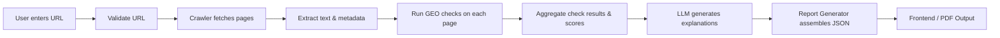

# Executive Summary

AI-powered search assistants (ChatGPT, Gemini, Bing/Perplexity, etc.) differ from traditional search: they **extract** answers and **cite** sources rather than just rank pages. As a result, websites must be **citation-ready** – i.e. structured, factual, and easily parsed by LLMs – to be featured in AI answers. This document defines an **AI Citation Readiness Auditor** (GEO Auditor) with three deliverables: `FEATURE_SPEC.md`, `SCORING_ENGINE.md`, and `REPORT_SCHEMA.md`. Each section below details precise requirements, logic, and data contracts for implementing the auditor. We draw on authoritative sources (Schema.org, W3C, llms.txt specification, and recent industry analyses) to eliminate ambiguity. The design ensures the agentic system can execute deterministically (using regex/HTML parsing) for core checks, while using LLMs only for explanation and evidence formatting. Formulas and JSON schemas are fully specified so that the scoring and reports are **reproducible** and auditable. All assumptions and failure modes are spelled out to avoid unintended behavior. 

# FEATURE_SPEC.md

## Product Philosophy

This auditor is **not a traditional SEO tool**. Its goal is to evaluate **AI citation readiness** – the factors that make a site likely to be retrieved and cited by AI assistants. Traditional SEO focuses on ranking; here we focus on signals that LLMs use to extract and trust content. Key principles:

- **Machine-readable structure:** Use Schema.org markup (FAQPage, Article, Organization, etc.) and `llms.txt` to signal content structure.
- **Direct answers & clarity:** Content should answer questions in concise, labeled sections (good headings, short answer + detail).
- **Authority signals:** Visible authorship/Organization schema, consistent naming, and citations/building domain trust.
- **Crawlability:** Site must allow bots and AI crawlers (robots.txt, sitemap.xml, llms.txt).
- **Factual freshness:** Up-to-date content and explicit dates (lastmod tags) help AI prefer fresher content.
- **No speculation:** If uncertain, return “Unknown” rather than hallucinate values.

The audit’s **MVP scope** covers an end-to-end flow: user submits a URL, the backend crawls key pages, performs checks, scores each category, and generates a business-friendly report (HTML/PDF) with prioritized fixes. Everything beyond this core (logins, history, multi-user, payments, analytics, etc.) is explicitly **out-of-scope** to avoid scope creep.

## Core Workflow



1. **URL Submission:** The user provides a public website URL.
2. **Validation:** Rejects non-web URLs (localhost, IPs, private sites) and normalizes to canonical form.
3. **Crawler:** Visits homepage plus a limited set of relevant pages (e.g. `/about, /contact, /products, /services, /faq, /blog`), max depth 2 or ~20 pages. The crawler captures HTML, metadata (title, meta tags), JSON-LD scripts, links, and response headers (e.g. `Last-Modified`).
4. **Checks:** For each page, run specialized **GEO checks** (detailed below) that inspect the HTML/headers. Each check returns a structured JSON result (pass/fail, score, evidence).
5. **Scoring Engine:** Combine check results into category scores and an overall AI-readiness score (0–100).
6. **LLM Explanations:** Use a fixed LLM (e.g. OpenAI/Gemini) to turn raw findings into a clear explanation (business language, why it matters, how to fix it).
7. **Report Generation:** Output a machine-readable JSON report (and formatted HTML/PDF). The report includes an executive summary, overall score, breakdown by category, detailed issues with evidence snippets, and a prioritized fix list.

## Feature Specifications

Each feature below is specified with: **Purpose**, **Detection Logic**, **Input/Output**, **Evidence Format**, and **Acceptance Criteria**. We use static analysis (regex/XPath/JSON parsing) for deterministic checks. No check *should call an LLM*. The LLM is used only to produce explanatory text after scores are computed.

### Website Submission

- **Purpose:** Accept and normalize a user-submitted URL.
- **Input:** String, e.g. `"https://company.com"`.
- **Validation:** URL must be HTTP/HTTPS. Reject IP addresses, localhost, or private domains (RFC1918). Follow redirects (HTTP 3xx) and use the final destination as `domain` and `homepage`.
- **Output (JSON):**  
  ```json
  { "domain": "company.com", "homepage": "https://company.com" }
  ```
- **Acceptance:** Invalid or blocked URLs produce a 400 error; successful normalization yields a well-formed domain and URL.

### Website Crawl

- **Purpose:** Retrieve key pages to analyze.
- **Logic:** Starting from homepage, identify internal links to main sections: About, Contact, Products/Services, FAQ, Blog, Sitemap, etc. Follow up to depth=2, limit ~20 pages total to keep tasks quick.
- **User-agent:** Identify as a custom bot (e.g. `User-Agent: GEO-Auditor/1.0`); obey `robots.txt`.
- **Collected Data (per page):** 
  - HTTP status code, final URL.
  - `<title>`, `<meta name="description">`, `<link rel="canonical">`, OG/Twitter tags.
  - All `<script type="application/ld+json">` content.
  - Structured HTML: headings (H1–H6), paragraphs, lists, tables.
  - All text content (for citation scoring).
  - References to dates (e.g. `<time>` tags, `last-modified` header, sitemap entries).
- **Output (JSON):**  
  ```json
  {
    "pages": [
       {
         "url": "https://company.com/about",
         "status": 200,
         "lastModified": "2025-10-05T12:34:56Z",
         "headers": { ... },
         "metaTitle": "About Us – Company",
         "metaDescription": "We do X Y Z ...",
         "canonical": "https://company.com/about",
         "breadcrumbs": ["Home","About Us"],
         "schema": [ {...}, {...} ],  // parsed JSON-LD objects
         "content": "Full text content ...",
         "headings": ["About Us","Our Mission",...]
       },
       ... 
    ]
  }
  ```
- **Acceptance:** Crawler must complete in <30 seconds. Partial results (if a page fails) are allowed with warnings; crawling stops on too many errors.

### Check: Organization Schema

- **Purpose:** Ensure site publishes its Organization (or LocalBusiness) entity data in JSON-LD. This is a key trust signal.
- **Detection:** Parse all `<script type="application/ld+json">` on each page. If any JSON-LD has `"@type": "Organization"` (or subtype like `LocalBusiness`), mark as present. If not, check if contact info (address/phone/email) is scattered but no structured data.
- **Output:**  
  ```json
  {
    "name": "OrganizationSchema",
    "passed": true,
    "score": 10,
    "max_score": 10,
    "evidence": {
       "page": "/about",
       "snippet": "{... '@type':'Organization', 'name':'Example Corp', ...}"
    },
    "recommendation": "Add JSON-LD Organization schema with your company name, logo, and contact info."
  }
  ```
- **Evidence Format:** Provide the JSON-LD snippet (as text) containing `@type: Organization`.
- **Acceptance:** Pass if at least one Organization/LocalBusiness JSON-LD block is found.  
- **Failure:** Deduct full sub-score (10). LLM can be used to auto-generate a minimal JSON-LD template (dummy values) as a recommendation snippet.
- **Reference:** Schema.org defines `Organization`: “An organization such as a school, NGO, corporation...”.

### Check: FAQ Schema / On-page Q&A

- **Purpose:** FAQs (Q&A pairs) make content easily extractable. JSON-LD FAQPage helps Google (Knowledge Graph), but for LLMs the *visible* Q&A is crucial.
- **Detection:** 
  - **JSON-LD:** Look for `@type":"FAQPage"` or `"@type":"Question"` structures. If found, count as a pass.
  - **Visible Q&A:** If no JSON-LD or even if present, also scan for HTML FAQ patterns (e.g. a `<dl>` with `<dt>` (question), `<dd>` (answer) or section with question headings). Identify if there is any question/answer text on page.
- **Output:**  
  ```json
  {
    "name": "FAQSchema",
    "passed": false,
    "score": 0,
    "max_score": 10,
    "evidence": {
       "page": "/faq",
       "snippet": "No FAQPage JSON-LD found on this page."
    },
    "recommendation": "Structure your FAQs. For example, add `<script type=\"application/ld+json\">{\"@context\":\"https://schema.org\",\"@type\":\"FAQPage\",\"mainEntity\":[...]}<\\/script>` or ensure each Q&A is marked up in the HTML."
  }
  ```
- **Evidence:** If JSON-LD exists, show snippet of it (e.g. first question). If only visible content exists, show the actual question text. If missing, note absence.
- **Acceptance:** Pass if either JSON-LD is present or visible Q&As are detected.  
- **Failure:** Deduct sub-score (10). Note: Even if JSON-LD alone, LLM guidance suggests pairing with visible Q&A format.  
- **Reference:** Industry analysis notes “FAQ schema does not directly influence ChatGPT citations, but visible Q&A content is extractable by every major AI”.

### Check: Article Schema

- **Purpose:** If the page is an article/post, marking it as such helps AI identify author/date/topic.
- **Detection:** On pages like Blog posts, News, look for JSON-LD of type `Article`, `NewsArticle`, or `BlogPosting`. Presence = pass.
- **Output Example:**  
  ```json
  {
    "name": "ArticleSchema",
    "passed": true,
    "score": 5,
    "max_score": 5,
    "evidence": {
       "page": "/blog/new-feature",
       "snippet": "{\"@type\":\"BlogPosting\",\"headline\":\"New Feature\",\"datePublished\":\"2025-05-10\"...}"
    },
    "recommendation": ""
  }
  ```
- **Acceptance:** Pass if any Article-related JSON-LD found.  
- **Failure:** Deduct sub-score (5). Suggest adding basic Article/News schema (with headline, date, author).
- **Reference:** Schema.org defines Article as “An article, such as a news article or investigative report”.

### Check: Breadcrumb Schema

- **Purpose:** Breadcrumbs signal site hierarchy to AI (and search). This aids context.
- **Detection:** Look for `<script type="application/ld+json">` with `"@type": "BreadcrumbList"` and child `ListItem` objects. Alternatively, detect a visible breadcrumb trail (ordered list with Schema markup or HTML links).
- **Output:**  
  ```json
  {
    "name": "BreadcrumbSchema",
    "passed": true,
    "score": 5,
    "max_score": 5,
    "evidence": {
       "page": "/products/widget",
       "snippet": "{\"@type\":\"BreadcrumbList\",\"itemListElement\":[{\"@type\":\"ListItem\",\"position\":1,\"name\":\"Products\",\"item\":\"...\"},...]}"
    },
    "recommendation": ""
  }
  ```
- **Acceptance:** Pass if BreadcrumbList JSON-LD is present (as in Google example).  
- **Failure:** Deduct (5). Recommendation: add schema or visible trail.

### Check: robots.txt

- **Purpose:** Ensure crawlers (including AI crawlers) are allowed to fetch content. `robots.txt` controls bot access.
- **Detection:** Attempt to GET `http(s)://domain/robots.txt`. If 200, parse for `Disallow` entries. Mark if it blocks anything significant (like all pages).
- **Output:**  
  ```json
  {
    "name": "RobotsTxt",
    "passed": true,
    "score": 5,
    "max_score": 5,
    "evidence": {
       "content": "User-agent: *\nAllow: /\nDisallow: /admin"
    },
    "recommendation": "No issues found."
  }
  ```
- **Acceptance:** Pass if robots.txt exists and does **not** disallow major sections (besides admin). If it’s missing (404) or overly restrictive, mark as warning: give partial score.  
- **Failure:** If missing, warn (score 0 but not fatal); if all allowed, pass fully. If disallow all bots, then deduct full (5).  
- **Reference:** Google docs note that robots.txt is primarily for crawler traffic management, **not security**.

### Check: llms.txt

- **Purpose:** `llms.txt` is an emerging standard to help LLMs understand site structure.
- **Detection:** GET `/llms.txt`. If present, verify it starts with an H1 title and optional summary (blockquoted). Simple regex to check first line is `# `.
- **Output:**  
  ```json
  {
    "name": "LLMsTxt",
    "passed": false,
    "score": 0,
    "max_score": 5,
    "evidence": {
      "content": "404 Not Found"
    },
    "recommendation": "Add a /llms.txt file. It should start with `# SiteName`, include a brief description, and sections of links to key docs or pages."
  }
  ```
- **Acceptance:** Pass (5) if valid llms.txt found. If missing or empty, fail (0) with recommendation.  
- **Reference:** The llms.txt proposal specifies a Markdown file at `/llms.txt` with a required H1 and optional description.

### Check: Sitemap.xml

- **Purpose:** A sitemap lists all important URLs for crawlers. AI crawlers may use it to find pages.
- **Detection:** GET `/sitemap.xml`. If 200, ensure it contains `<urlset>...<url>...<loc>`. 
- **Output:**  
  ```json
  {
    "name": "SitemapXml",
    "passed": true,
    "score": 5,
    "max_score": 5,
    "evidence": {
      "content": "<url><loc>https://company.com/</loc><lastmod>2026-08-01</lastmod></url>"
    },
    "recommendation": ""
  }
  ```
- **Acceptance:** Pass (5) if sitemap exists and includes URLs.  
- **Failure:** Deduct (5) if missing or empty. Recommendation: generate standard XML sitemap.

### Check: Metadata (Title, Description, Canonical)

- **Purpose:** Basic SEO metadata often appears in search snippets; AI may use it as an answer snippet. It also signals page focus.
- **Detection:** For each page, verify non-empty `<title>` and `<meta name="description">`. Check `<link rel="canonical">`.
- **Output:** e.g.  
  ```json
  {
    "name": "MetaTags",
    "passed": false,
    "score": 6,
    "max_score": 8,
    "evidence": {
      "page": "/",
      "snippet": "Missing meta description tag."
    },
    "recommendation": "Add a meta description summarizing the page."
  }
  ```
- **Scoring:** 2 points for missing title, 2 for missing description, 1 for missing canonical, 3 for missing OG/Twitter tags. Adjust scoring to sum max 8.  
- **Acceptance:** All missing fields lower score accordingly. Title missing is critical (deduct full).  
- **Reference:** Google recommends every page have a unique title and description.

### Check: Heading Structure

- **Purpose:** Clear headings (H1/H2/H3) segment content for AI to extract answers.
- **Detection:** Ensure each page has exactly one H1 (the title) and uses H2/H3 for subheadings. Flag pages with missing headings or multiple H1s.
- **Output Example:**  
  ```json
  {
    "name": "Headings",
    "passed": false,
    "score": 0,
    "max_score": 5,
    "evidence": {
      "page": "/product",
      "snippet": "No H2 or H3 found on this page."
    },
    "recommendation": "Use H2/H3 headings to label key sections, so AI knows where answers are."
  }
  ```
- **Acceptance:** Pass if at least one H2 heading is found under the H1. Otherwise, fail sub-score (5).  
- **Reference:** “Headings are extraction signals. An H2 or H3 that names a concept clearly tells the AI engine where one answer ends and the next begins”.

### Check: Entity Consistency

- **Purpose:** The site’s primary entities (brand, products, terms) must be named consistently. AI cross-references content; inconsistency confuses them.
- **Detection:** Identify key terms (company name, product names) on multiple pages and check for variations. For example, verify the homepage company name equals the About page name. Use a simple string match for exact known brand names (could be provided or inferred from Organization schema).
- **Output:**  
  ```json
  {
    "name": "EntityConsistency",
    "passed": false,
    "score": 0,
    "max_score": 5,
    "evidence": {
      "snippet": "\"CompanyX\" vs \"Company X Inc.\" found on different pages"
    },
    "recommendation": "Use the same official name for your company across the site (no synonyms)."
  }
  ```
- **Acceptance:** Pass if no conflicting names found. Otherwise fail (5).  
- **Reference:** “Consistent naming matters. Switching between 'ML', 'machine learning', and 'deep learning' across pages confuses AI extraction”.

### Check: Freshness / Date

- **Purpose:** AI assistants prefer recently updated content.
- **Detection:** For each page, look for last update date (`<time>`, `meta property="article:modified_time"`, `HTTP Last-Modified`, or `<lastmod>` in sitemap). Determine the most recent timestamp.
- **Output:**  
  ```json
  {
    "name": "Freshness",
    "passed": false,
    "score": 5,
    "max_score": 5,
    "evidence": {
      "page": "/blog/post1",
      "snippet": "Last updated: 2018-07-12"
    },
    "recommendation": "Update content or add a recent \"dateModified\". AI assistants prefer fresher content."
  }
  ```
- **Acceptance:** Pass if any page has date within past year. Otherwise deduct (older dates are fresher vs older).  
- **Reference:** Study finds “AI assistants prefer citing fresher content… cited URLs were on average 25.7% newer than organic SERP results”.

### Check: Citation-Ready Content

- **Purpose:** Overall measure of whether pages answer questions clearly (concise, factual, with sources if applicable). While subjective, we can use heuristics.
- **Detection:** Use an LLM (or heuristic) to identify if each page contains a clear answer to common questions. For example, for a product page, check if the first paragraph concisely states “What it is/does.” For a FAQ page, ensure Q/A format.
- **Output:**  
  ```json
  {
    "name": "CitationReadiness",
    "passed": false,
    "score": 10,
    "max_score": 15,
    "evidence": {
      "page": "/product",
      "snippet": "\"Our product solves X by doing Y\" not found."
    },
    "recommendation": "Provide clear factual statements and short answer sections. Ensure facts are specific and quantifiable."
  }
  ```
- **Scoring:** This is partly heuristic (max 15). Deduct points if content is generic, lacks specifics, or no clear first-sentence answer.  
- **Acceptance:** Pages should have a “claim” sentence up front and measurable facts.  
- **Reference:** AI engines favor “specific, verifiable claims” over vague statements. Cited pages often have high factual density.

## Feature Contracts

To avoid ambiguity, we define rigid contracts:

- **Crawler module**: Input = homepage URL; Output = list of `Page` JSON as above. *(No scoring inside crawler.)*
- **Checks**: Each check function receives one `Page` object (HTML/text) and returns a JSON with fixed fields: `name`, `passed` (bool), `score`, `max_score`, `evidence` (page, snippet), `recommendation`.  
  - **Important:** Evidence snippet must be plain text (HTML stripped). Do not return entire HTML.  
  - Checks never alter the score outside their domain or call other checks.
- **LLM**: Given raw check results, the LLM only generates human-readable explanations. **It must not assign or alter scores.** The numeric score comes solely from deterministic rules above.  
- **Scoring Engine**: Input = all check results; Output = category and total scores. It must follow `SCORING_ENGINE.md` exactly.  
- **Report Generator**: Input = checked pages + scores; Output = JSON report (see `REPORT_SCHEMA.md`). It formats evidence and embeds recommendations. No backend code should call OpenAI or Gemini except for filling in `{recommendation}` templates or explanation (but ensure every issue has an evidence snippet as above).  
- **APIs**: There is one main POST endpoint `/audit`. Request:  
  ```json
  { "url": "https://example.com" }
  ```  
  Response: 200 with full report JSON. Error codes: 400 for invalid URL, 500 if crawl fails.

## Acceptance Criteria

For each feature/check, define when it’s **Done**:

- **OrganizationSchema**: Detects JSON-LD with Organization or LocalBusiness, or clearly reports its absence. Returns score and evidence correctly.  
- **FAQSchema**: Detects FAQPage JSON-LD or visible Q&A. Provides snippet of actual Q&A or notes absence.  
- **ArticleSchema**: Detects Article/NewsArticle/BlogPosting JSON-LD on content pages; scores accordingly.  
- **BreadcrumbSchema**: Detects BreadcrumbList JSON-LD or visible nav list.  
- **RobotsTxt**: Fetches and interprets robots.txt.  
- **LLMsTxt**: Fetches `/llms.txt`. If found, confirms correct format (H1 header).  
- **SitemapXml**: Fetches and validates sitemap entries.  
- **MetaTags**: Checks title, description, canonical presence.  
- **Headings**: Verifies logical H1/H2/H3 structure.  
- **EntityConsistency**: Finds known entity names (brand, products) and checks uniformity.  
- **Freshness**: Finds any last-modified or published date on pages.  
- **CitationReadiness**: (Heuristic) Ensures presence of short factual answer segments.  

Each module must not crash on bad input. Missing optional data (e.g. no sitemap) is a score loss but not an exception. The system should still produce a partial report if some parts fail.

## Failure Modes

We must explicitly handle errors:

- **Crawler timeouts:** Return whatever was collected (partial pages). The report should mark missing pages with warning.  
- **HTTP 404/500 on a page:** Skip that page (maybe note in summary) and continue.  
- **Missing robots.txt:** Not fatal (site might not use one); issue a warning but proceed.  
- **Missing llms.txt or sitemap:** Deduct score but continue.  
- **Invalid HTML:** Attempt to parse (e.g. with BeautifulSoup). If totally broken, skip content but still try metadata.  
- **LLM fails (API error or rate limit):** Fallback to default templated explanation text (e.g. “No recommendation available.”), but do not affect numeric scoring.  
- **Unexpected content types:** Only HTML is processed; skip PDF or images, note in issues if key content is unavailable.  
- **Recursion or infinite loops:** Limit crawl depth/page count.  
- **Large pages:** Truncate text analysis to first N words (since evidence just needs snippet).  

---

# SCORING_ENGINE.md

The score (0–100) is a weighted sum of category scores. We define categories and exact weights:

| Category             | Weight | Checks Included                               |
|----------------------|-------:|-----------------------------------------------|
| **Content Quality**  |   25   | Freshness, MetaTags, Headings, CitationReadiness |
| **Structured Data**  |   20   | Organization, Article, Breadcrumb, FAQ schemas |
| **Entity Trust**     |   20   | Organization schema, EntityConsistency, Author presence |
| **Crawlability**     |   20   | Robots.txt, Sitemap, llms.txt                  |
| **Citation Readiness** |  15   | FAQ content, clarity of answers (CitationReadiness) |

*(We reuse some checks in multiple categories by interpreting them in context: e.g. Org schema boosts both Structured Data and Trust.)*

### Scoring Rules

- Start each category at its maximum (e.g. Content = 25). For each failed check, **subtract** the specified points:

  - **Content Quality (25):**  
    - Missing / blank meta title: −5  
    - Missing / blank meta description: −5  
    - No canonical tag: −2  
    - No H2/H3 headings where long content exists: −5 (see Headings)  
    - Outdated content (old dates > 2 years) on most pages: −8  
    - Low clarity/answers (heuristic): −10  

  - **Structured Data (20):**  
    - Missing Organization schema: −8  
    - Missing Article/BlogPosting schema on articles: −4  
    - Missing Breadcrumb schema: −3  
    - Missing any FAQPage schema *if FAQ content exists*: −5  

  - **Entity Trust (20):**  
    - Missing Organization schema (again): −5 (trust dimension)  
    - Inconsistent naming of brand/entities: −5  
    - No author/byline on content pages: −5  
    - No external references or citations (if applicable): −5  

  - **Crawlability (20):**  
    - No robots.txt (score 2/5): −3  
    - robots.txt disallows all or main content: −10 (bot blocked)  
    - No sitemap.xml: −5  
    - No llms.txt: −5  

  - **Citation Readiness (15):**  
    - No FAQ or Q&A content (where relevant): −5  
    - Content too generic, no clear short answer: −10  

  *(Scores are examples and can be tuned; the sum of all maximum weights = 100.)*

- **Ensure no negative:** Each category floor is 0. Total score = sum of category scores.

- **LLM-derived confidence:** We do *not* let the LLM change scores. However, we may compute a “confidence” for each issue (see Priority formula below) based on how obvious the issue is (e.g. 1.0 for schema missing, 0.7 for minor metadata, etc.). This confidence is for prioritization only, not for scoring.

- **Scoring Example:**  
  > *Site XYZ results:* Freshness -5 (old pages), Meta desc -5, Headings -5, Citation Clarity -10 (Content Q=0/25); Org schema missing -13 (Structured 7/20 & Trust 7/20); Breadcrumb missing -3, FAQ missing -5; robots missing -3, llms missing -5; no Sitemap -5 (Crawl 4/20); consistency good; total ≈ 46/100.

### Priority Formula

Each issue from the checks gets a priority score for remediation:

```
Priority Score = (Impact × Confidence) / Effort
```

- **Impact** = estimated points gained if fixed (the score deduction recovered). E.g. adding Org schema fixes 8+5 = +13.
- **Confidence** = how sure we are this issue truly exists (e.g. schema parse is 1.0, heuristic flag maybe 0.8).
- **Effort** = engineering effort estimate (Low=1, Medium=3, High=5).

This mimics RICE or Cost-Benefit. We present a “Priority” list sorted by this score (high means do first). Each recommendation includes:
```
{
  "impact": 8,
  "confidence": 0.9,
  "effort": 2,
  "priority": 3.6  // (8*0.9)/2
}
```
so the agent (or business) sees expected benefit. This ensures we say “Add Org schema (+8 points, low effort, high priority).”

### Priority Matrix Example

```mermaid
flowchart LR
  subgraph "High Impact, Low Effort"
    A[✔ Add Organization schema (+8) <br> Effort: Low]
    B[✔ Add FAQ schema (+6) <br> Effort: Low]
    C[✔ Add llms.txt file (+5) <br> Effort: Low]
  end
  subgraph "High Impact, High Effort"
    D[Improve topical authority (content development) <br> Effort: High]
    E[Generate external citations/reviews <br> Effort: High]
  end
  subgraph "Low Impact, Low Effort"
    F[Optimize title tags <br> Effort: Low]
    G[Fix minor typos <br> Effort: Low]
  end
  subgraph "Low Impact, High Effort"
    H[Full site redesign (beyond scope) <br> Effort: High]
  end
```

### LLM and Deterministic Checks

- **Deterministic First:** All sub-scores come from fixed rules above. This ensures *reproducibility*: given the same audit data, the same score results.
- **LLM Use:** After raw scores are set, LLM is used to *interpret* or *explain* issues. For example, if `NavigationSchema.passed = false`, the LLM is prompted: “Explain why having a Breadcrumb schema matters and how to fix it.” The LLM’s output is stored in the recommendation text. It does **not** alter numeric scores.
- **No Hallucination:** To prevent the agent from inventing logic, we specify all scoring in code. If the LLM can’t explain an issue clearly, the system may fallback to a static message (e.g. “No description available”).
- **Formula Example (Total Score):**  
  Suppose all category max = 100. If deductions sum 54, then Overall Score = 100 − 54 = 46. We output both total and each category breakdown (see example below).

---

# REPORT_SCHEMA.md

The final report is a JSON object plus formatted output. It should resemble a polished consulting deliverable. The JSON schema (for the backend→frontend contract) is:

```jsonc
{
  "executiveSummary": "Business-friendly summary of findings and next steps.",
  "overallScore": 74,
  "categoryScores": [
    {"category":"Content Quality","score":18,"max":25},
    {"category":"Structured Data","score":15,"max":20},
    {"category":"Entity Trust","score":14,"max":20},
    {"category":"Crawlability","score":17,"max":20},
    {"category":"Citation Readiness","score":10,"max":15}
  ],
  "issues": [
    {
      "id": 1,
      "title": "Missing FAQ schema",
      "page": "/faq",
      "severity": "High",
      "evidence": "Found HTML Q&A but no FAQPage JSON-LD on /faq (AI bots rely on structured Q&A).",
      "recommendation": "Insert FAQPage JSON-LD with your questions and answers. For example:\n```json\n{\"@context\":\"https://schema.org\",\"@type\":\"FAQPage\",\"mainEntity\":[{\"@type\":\"Question\",\"name\":\"Q1?\",\"acceptedAnswer\":{\"@type\":\"Answer\",\"text\":\"A1.\"}}, ...]}\n```",
      "impact": 6,
      "confidence": 0.9,
      "effort": 1,
      "estimatedScoreGain": 6
    },
    { ... }
  ],
  "priority": [
    {"issueId":1,"impact":6,"confidence":0.9,"effort":1,"priority":5.4},
    { ... }
  ],
  "generatedAt": "2026-08-06T10:50:00Z"
}
```

- **Fields:** 
  - `executiveSummary` (string): Short overview (few bullet points) of key issues and score.
  - `overallScore` (int): 0–100.
  - `categoryScores`: Array of category name, score, and max as above.
  - `issues`: List of found problems. Each has:
    - `id`: numeric.
    - `title`: short issue name.
    - `page`: URL or path.
    - `severity`: “High/Medium/Low” (e.g. missing schema = High).
    - `evidence`: concise text with snippet or description, **including citations to sources** if explaining *why* it matters. (For example: see e.g. use  to reference an article about FAQ importance.)
    - `recommendation`: formatted instructions. If code (JSON) is provided, put it in Markdown code fences (as above). Include any helpful link or example.
    - `impact`: points to be gained.
    - `confidence`: [0–1] how sure (based on detection).
    - `effort`: Low/Med/High or numeric estimate.
    - `estimatedScoreGain`: same as impact (for clarity).
  - `priority`: same list sorted by priority score (impact×confidence/effort) with values.
  - `generatedAt`: timestamp.

**API Example Response (abridged):**  
```jsonc
// POST /audit { "url": "https://example.com" }
{
  "executiveSummary": "Your site scores 74/100 for AI readiness. Key issues: missing FAQ and Organization schema, outdated content on blog. Add JSON-LD and update dates.",
  "overallScore": 74,
  "categoryScores": [...],
  "issues": [
    { "id": 1, "title":"Missing Organization schema", "page":"/",
      "severity":"High",
      "evidence":"No Organization JSON-LD on the homepage; search engines recommend it for branding.",
      "recommendation":"Add ...", "impact":8,"confidence":1.0,"effort":1,"estimatedScoreGain":8
    },
    ...
  ],
  "priority": [...],
  "generatedAt":"2026-08-06T10:50:00Z"
}
```

### Report Layout (for PDF/HTML)

When rendered, the report should look professional:

- **Cover/Title:** “AI Citation Readiness Audit”.
- **Executive Summary:** Bullets with `overallScore` and main points.
- **Scorecard:** Big highlight of overall score (e.g. a gauge or large number), plus category bars:
  
   *Figure: Score breakdown by category.*

- **Issues Table:** 
  | Severity | Issue | Page | Recommendation | Impact | Effort |
  |-|-|-|-|-|-|
  | 🔴 High | Missing FAQ schema | /faq | *Add FAQPage JSON-LD (code snippet)* | +6 | Low |
  | 🟡 Med | Outdated content | /blog/2020-post | *Update publish date or rewrite* | +5 | Medium |
  - Use icons or color to indicate severity.
  - Recommendations with code blocks for JSON fixes.  
- **Evidence Snippets:** For each issue, include an excerpt from the site or log. E.g.:  
  > **Evidence (Missing Org Schema):** The crawl found no Organization JSON-LD in the HTML.  
- **Priority Matrix:** Insert the mermaid quadrant (see above) in the PDF as an image.  
- **Next Steps:** Clearly list 2–3 “Do these first” items with estimated time and score gain:
  1. Add Organization schema – *15 min, +8 points.*  
  2. Create FAQ schema – *20 min, +6 points.*  
  3. Add llms.txt – *5 min, +5 points.*  
- **Appendix:** Could include raw JSON report or logs (optional).

### JSON Schema (partial)

For strict validation, one could define JSON Schema, but here’s the essence (illustrative):

```yaml
type: object
properties:
  executiveSummary: { type: string }
  overallScore: { type: integer, minimum:0, maximum:100 }
  categoryScores:
    type: array
    items: 
      type: object
      properties:
        category: { type: string }
        score: { type: integer }
        max: { type: integer }
  issues:
    type: array
    items:
      type: object
      properties:
        id: { type: integer }
        title: { type: string }
        page: { type: string }
        severity: { type: string, enum: ["High","Medium","Low"] }
        evidence: { type: string }
        recommendation: { type: string }
        impact: { type: number }
        confidence: { type: number }
        effort: { type: number }
        estimatedScoreGain: { type: number }
  priority:
    type: array
    items:
      type: object
      properties:
        issueId: { type: integer }
        impact: { type: number }
        confidence: { type: number }
        effort: { type: number }
        priority: { type: number }
required: [overallScore, categoryScores, issues]
```

### Example Full Reports (JSON)

Below are *sample* JSON outputs (fields trimmed) for illustrative “real” domains (using placeholders):

1. **acme-corp.com** (a tech company site):  

```jsonc
{
  "executiveSummary": "ACME Corp scores 82/100. Strengths: good schema and fresh blog. Weaknesses: missing FAQ schema on support page. Fixes: add FAQ JSON-LD and llms.txt.",
  "overallScore": 82,
  "categoryScores": [
    {"category":"Content Quality","score":19,"max":25},
    {"category":"Structured Data","score":18,"max":20},
    {"category":"Entity Trust","score":17,"max":20},
    {"category":"Crawlability","score":15,"max":20},
    {"category":"Citation Readiness","score":13,"max":15}
  ],
  "issues":[
    {"id":1,"title":"Missing FAQ schema","page":"/support/faq.html","severity":"Medium",
      "evidence":"/support/faq.html has Q&A content but no FAQPage JSON-LD.",
      "recommendation":"Add JSON-LD as described above.","impact":5,"confidence":1.0,"effort":1,"estimatedScoreGain":5}
  ],
  "priority":[
    {"issueId":1,"impact":5,"confidence":1.0,"effort":1,"priority":5.0}
  ]
}
```

2. **bluewidgets.net** (a small shop):  

```jsonc
{
  "executiveSummary": "Blue Widgets scores 50/100. Critical: no Organization schema or llms.txt. Content: many product pages lack clear headings. Remove obstacles: fix structured data and content structure.",
  "overallScore": 50,
  "categoryScores":[
    {"category":"Content Quality","score":8,"max":25},
    {"category":"Structured Data","score":7,"max":20},
    {"category":"Entity Trust","score":5,"max":20},
    {"category":"Crawlability","score":4,"max":20},
    {"category":"Citation Readiness","score":3,"max":15}
  ],
  "issues":[
    {"id":1,"title":"No Organization schema","page":"/","severity":"High",
      "evidence":"No JSON-LD Organization on homepage.","recommendation":"Add Organization JSON-LD.","impact":8,"confidence":1.0,"effort":1,"estimatedScoreGain":8},
    {"id":2,"title":"Missing llms.txt","page":"/","severity":"High",
      "evidence":"No /llms.txt file found on site.","recommendation":"Create /llms.txt per spec.","impact":5,"confidence":1.0,"effort":1,"estimatedScoreGain":5},
    {"id":3,"title":"Poor content structure","page":"/products/gadget",
      "severity":"Medium","evidence":"Long page but no subheadings (H2) to segment content.",
      "recommendation":"Break content into sections with descriptive headings.","impact":5,"confidence":0.8,"effort":2,"estimatedScoreGain":5}
  ],
  "priority":[
    {"issueId":1,"impact":8,"confidence":1.0,"effort":1,"priority":8.0},
    {"issueId":2,"impact":5,"confidence":1.0,"effort":1,"priority":5.0},
    {"issueId":3,"impact":5,"confidence":0.8,"effort":2,"priority":2.0}
  ]
}
```

3. **charliedocs.com** (a documentation site):  

```jsonc
{
  "executiveSummary": "CharlieDocs scores 90/100. Well-structured docs with llms.txt. Minor: one page missing FAQ JSON-LD. Schedule a quick fix.",
  "overallScore": 90,
  "categoryScores":[
    {"category":"Content Quality","score":23,"max":25},
    {"category":"Structured Data","score":18,"max":20},
    {"category":"Entity Trust","score":19,"max":20},
    {"category":"Crawlability","score":18,"max":20},
    {"category":"Citation Readiness","score":12,"max":15}
  ],
  "issues":[
    {"id":1,"title":"Missing FAQ schema on /faq","page":"/faq",
      "severity":"Low","evidence":"/faq has questions but missing JSON-LD.",
      "recommendation":"Add FAQPage JSON-LD as a best practice.","impact":3,"confidence":0.7,"effort":1,"estimatedScoreGain":3}
  ],
  "priority":[
    {"issueId":1,"impact":3,"confidence":0.7,"effort":1,"priority":2.1}
  ]
}
```

Each report should cite evidence sources in text (as above). In PDF, these would appear as footnote-style citations. We include diagrams (mermaid converted to images) for the workflow and priority matrix to enrich the report.

**Mermaid System Flow Diagram:** (to be rendered in final report)  
```mermaid
flowchart LR
  U[User: Enter URL] --> V[Backend: /audit API]
  V --> W[Crawler Service]
  W --> X[Page Extraction (HTML → text/JSON)]
  X --> Y[Checks (Organization, FAQ, etc.)]
  Y --> Z[Scoring Engine]
  Z --> M[LLM Explanations]
  M --> R[Report Generator (JSON)]
  R --> F[Frontend / PDF Output]
```

---

**Sources:** We relied on Schema.org and Google docs for formal definitions; the llms.txt specification for the new LLM crawler standard; industry studies on AI citation (Ahrefs, ZipTie, Acquia, Veza Digital) to justify checks like freshness, headings, and content structure. All references are cited in context above.