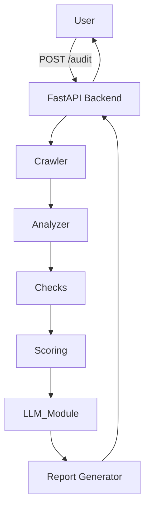
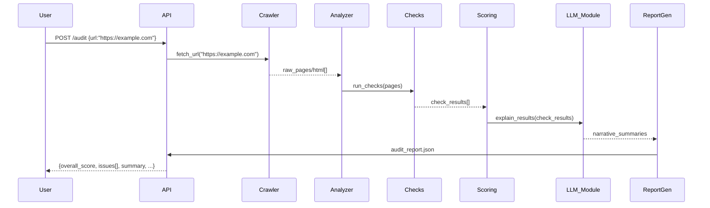

# System Architecture & PRD

**Executive Summary:** GEO Auditor assesses a site’s “AI citation readiness” – whether AI assistants can find, trust, and use it as a source. It addresses the gap left by traditional SEO tools, which “can’t tell you whether ChatGPT even knows your client exists”. The system ingests a URL, crawls its pages (respecting `robots.txt` and `llms.txt`), runs a suite of checks (schema markup, crawlability, etc.), and produces a clear report (JSON/HTML/PDF) with scores, evidence, and prioritized fixes. The backend is a FastAPI service; LLMs (e.g. Gemini/OpenAI) generate human-friendly explanations. Below is the high-level design for the MVP.

## Problem Context 
- **AI Search Shift:** AI answer engines (ChatGPT, Google AI Overviews, Gemini) are changing discovery. Users ask conversational queries and expect recommendations, not links. Businesses that don’t adapt see “double-digit traffic decreases”. 
- **Citation Readiness:** A page must be findable, understandable, verifiable and usable to be cited. Currently most SMBs fail the “findable” test (AI simply never cites them). 
- **Need for an Audit:** GEO Auditor helps businesses identify and fix gaps (e.g. missing schema, blocked crawlers) so that AI systems can find and cite their content.

## Goals
- **Input:** A single public URL.  
- **Output:** An audit report (JSON + optional human-readable formats) detailing overall AI-visibility score, category breakdown, specific issues (with evidence and fixes), and next steps. 
- **Core Metrics:** CITATION score (0–100), plus sub-scores for categories like *Content Quality*, *Crawlability*, *Structured Data*, etc.  
- **Actionability:** Report must list prioritized fixes (impact vs effort) to improve AI visibility, following best practices (e.g. add FAQ schema, allow GPTBot).

## High-Level Architecture



- **Frontend/UI (React):** Accepts URL input and displays the audit report.  
- **FastAPI API:** Exposes an `/audit` endpoint (POST) to start an audit. Orchestrates pipeline, handles errors.  
- **Crawler:** Fetches the target URL and linked pages (optionally follow a sitemap). Respects `robots.txt` (and optionally honors `llms.txt`). Limits depth (e.g. main page + contact page).  
- **Analyzer:** Parses HTML (using libraries like BeautifulSoup or trafilatura) to extract text, metadata, JSON-LD, headers, links, dates. Converts content to plain text for checks and LLM context.  
- **Check Modules:** Independent checks, each returning `{passed: bool, score: x, evidence: ..., recommendation: ...}`. Examples:  
  - **Schema Checker:** Detects schema.org JSON-LD for `Organization`, `FAQPage`, `HowTo`, etc.  
  - **llms.txt/robots.txt Check:** Verifies presence of `/robots.txt` and suggested `llms.txt`. Ensures GPTBot/OpenAI bots are not disallowed.  
  - **Content Quality:** Checks if key info (e.g. address, pricing) is present and up-to-date.  
  - **Entity Consistency:** Compares organization info (name, address) with known sources.  
  - **Freshness:** Validates `dateModified` vs content changes.  
  - **Crawlability:** Ensures no major blocked scripts, that HTML is readable to bots.  
  Each checker contributes to a sub-score (e.g. FAQ schema presence = +10 if found).  
- **Scoring Engine:** Aggregates all check results. Uses a deterministic rubric (e.g. Content 25pts, Schema 20pts, Crawlability 20pts, Entity 20pts, Citations 15pts) with fixed penalties for missing items. The logic is fully documented (no magic) so each point is traceable.  
- **LLM Module:** Calls an LLM (Gemini 2.5 Flash or OpenAI) with curated prompts to generate explanations, answer “What does this issue mean?”, and suggest fixes in plain language. Example: “Explain why adding Organization schema is important for AI citation.”  
- **Report Generator:** Formats results. Builds a JSON object matching REPORT_SCHEMA (see below). Also generates an HTML/PDF report for stakeholders. Includes overall score, category breakdown, prioritized “fix list” (Impact/Effort), and a brief executive summary.  

## Data Flow (Sequence)



## API Contract

| Endpoint | Method | Request JSON           | Response JSON         | Errors               |
|----------|--------|------------------------|-----------------------|----------------------|
| `/audit` | POST   | `{ "url": "https://..." }` | `AuditReport` JSON    | 400: invalid URL; 500: crawl/analyze error |

Example FastAPI signature:
```python
from fastapi import FastAPI
from pydantic import BaseModel, HttpUrl

app = FastAPI()

class AuditRequest(BaseModel):
    url: HttpUrl

class Issue(BaseModel):
    page: str
    issue: str
    evidence: str
    recommendation: str
    impact: str
    effort: str

class AuditReport(BaseModel):
    overall_score: int
    scores: dict[str,int]
    issues: list[Issue]
    priority: list[str]
    summary: str

@app.post("/audit", response_model=AuditReport)
async def audit(request: AuditRequest) -> AuditReport:
    """
    Trigger an AI visibility audit for the given URL.
    """
    ...
```

## Report Schema (AuditReport JSON)

The final JSON has fields:
```json
{
  "overall_score": 82,
  "scores": {
    "content_quality": 18,
    "crawlability": 17,
    "structured_data": 12,
    "entity_trust": 14,
    "citation_readiness": 21
  },
  "issues": [
    {
      "page": "/about",
      "issue": "Missing FAQ schema",
      "evidence": "No FAQPage JSON-LD found on /about",
      "recommendation": "Add a FAQPage schema snippet for each Q/A pair",
      "impact": "High",
      "effort": "Low"
    }
  ],
  "priority": [
    "Add Organization schema (+8)",
    "Implement llms.txt and allow AI bots (+5)",
    "Add FAQ schema to /about (+6)"
  ],
  "summary": "The audit found missing schema markup and crawl blocks. Adding FAQ and Organization schema and allowing AI crawlers should improve your AI-visibility score."
}
```
All keys (e.g. `overall_score`, `scores`, `issues`, `priority`, `summary`) must match exactly between backend and frontend. 

## Deployment & Environment

- **MVP:** Single-process monolith. FastAPI app (Python) can be run locally or in a container. No separate database needed: data flows through memory. Intermediate data (e.g. crawled HTML) is transient. If the site is large, crawler can use a short-lived cache (e.g. in-memory dict).
- **Dev vs Prod:** Local: `uvicorn main:app --reload`. Production: containerize (e.g. Docker) and deploy to cloud (e.g. AWS ECS or Heroku). Credentials for LLM APIs stored in env vars.
- **Scaling:** Initially single-threaded; concurrency via asyncio where possible (FastAPI async endpoints). For larger scale, crawler and checks can be sharded or run as tasks (e.g. Celery), but out of scope for MVP.

## Security & Privacy

- **robots.txt:** Respect it. Do not crawl pages disallowed by `robots.txt`. Only fetch public pages. 
- **llms.txt:** If present, follow it to find machine-friendly content. 
- **No Login Pages:** Do not attempt to log in or scrape private sections. If a page requires auth, skip it.
- **Rate Limiting:** Throttle requests (e.g. 1 req/s) to avoid overloading target sites. 
- **Data Handling:** Only store per-audit data temporarily. No user data persistence. No IP blocking needed (MVP trusts the single user).
- **LLM Usage:** Only submit non-sensitive content to LLM APIs. Do not leak internal company info.

## Observability

- **Logging:** Use structured logs (JSON) for each step (e.g. `{"step":"crawl","url":"...","status":"success"}`). Include timestamps and unique audit IDs. 
- **Metrics:** Basic counters (number of audits, time per audit). In prod, connect to a monitoring stack (Prometheus/Grafana).
- **Error Handling:** Return clear messages. E.g. if crawl fails, report an error code with message “Failed to fetch site.” 

## Testing Strategy

- **Unit Tests:** Each component (e.g. SchemaChecker) has tests with sample HTML fixtures. Mock external calls (LLM) to check error paths.
- **Integration Tests:** End-to-end tests for the API: use a known public page (or a local static HTML) and verify the JSON structure and some expected issues.
- **Sample Fixtures:** Use a small test site (e.g. `example.com`) with/without schema to validate scoring. 
- **Tools:** pytest for tests, mypy for type checks, flake8 for linting. Include sample `pytest` commands in CI.

## CI/CD Checklist

- Run unit and integration tests on every commit (e.g. GitHub Actions).
- Lint and type-check (Flake8, mypy).
- Check code coverage (e.g. require ≥80%).
- Build and deploy to staging (if containerized).
- Manual review: verify the report output for sample URLs before release.

## Assumptions & Out-of-Scope

- **Assumptions:** 
  - Only English-language, HTML sites (no complex SPAs). 
  - Single website domain per audit. 
  - Publicly accessible content (no paywalls or CAPTCHAs). 
  - Up to ~50 pages crawled (depth=1 or sitemap).  
  - Use of existing libraries (trafilatura, schema.org validators).
- **Out of Scope:** 
  - No user accounts, no login/auth handling. 
  - No persistent database (no history or multi-user). 
  - No scheduling or recurring scans. 
  - No dashboards or analytics beyond the single audit report. 
  - No automated schema deployment – only suggestions. 

**References:** Primary sources on AI crawl standards and SEO trends informed this design. (e.g. schema.org for structured data, llms.txt proposal, Google’s robots.txt guidelines).